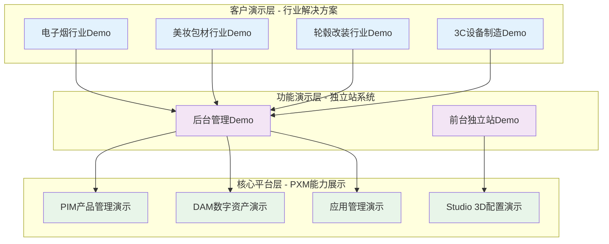

# PXM Demo 项目总览

> **项目定位**：构建面向客户讲解的Demo演示系统，通过高度抽象的模块化设计，展示PXM平台如何为不同行业提供完整的数字化解决方案，帮助客户理解PXM的核心价值和应用场景。

> **重要说明**：这是一个**自定义Demo系统**，非真实业务系统。PXM模块由研发团队开发，独立站前后台系统将基于客户特征深度定制，用于向客户展示行业解决方案的完整逻辑。

---

## 一、项目核心目标

### 1.1 演示目标
- **展示PXM平台价值**：通过多行业应用场景，让客户直观理解PXM系统在产品管理、数字资产管理、3D配置等方面的核心能力
- **提供行业解决方案模板**：为美妆包材、电子烟、轮毂改装、3C设备制造四个行业提供可参考的数字化解决方案
- **简化复杂业务逻辑**：通过高度抽象的模块化设计，让客户快速理解PXM如何解决其业务痛点

### 1.2 技术目标
- **模块化架构设计**：建立清晰的模块边界，便于向客户讲解各部分功能和价值
- **可视化数据流**：完整展示从PXM到独立站的数据流转过程
- **交互式演示**：提供可操作的Demo界面，让客户亲身体验PXM的核心功能

---

## 二、整体架构设计

### 2.1 Demo系统架构



### 2.2 演示数据流设计
```
PXM平台（能力展示） → 独立站后台（功能演示） → 独立站前台（客户体验）
```

**核心设计理念**：
- **高度抽象**：每个模块都突出核心功能，简化复杂细节
- **可视化展示**：通过图表、动画等形式展示数据流转过程
- **交互式体验**：客户可以操作各个模块，亲身体验PXM价值

---

## 三、行业解决方案设计

### 3.1 电子烟行业解决方案 ✅ 已完成设计

**演示重点**：展示PXM如何解决电子烟行业的复杂产品管理问题

**当前状态**：已完成详细数据模型和架构设计

**核心演示点**：
- **产品复杂性管理**：设备、烟弹、雾化芯、配件的多层级产品结构
- **SKU智能管理**：颜色 + 地区版本的多维度SKU组合
- **合规性展示**：年龄验证、尼古丁警告、防伪验证等合规功能
- **兼容性管理**：设备-烟弹兼容性矩阵的智能管理

**数据模型设计**：28张表，用于演示完整的数据管理能力

---

### 3.2 美妆包材行业解决方案 🚧 正在设计

**演示重点**：展示PXM如何支持定制化B2B业务场景

**当前状态**：已爬取客户参考网站，正在设计解决方案

**核心演示点**：
- **DIY定制能力**：产品形状选择、颜色自定义、设计上传、3D预览
- **B2B业务逻辑**：MOQ定价、样品申请、阶梯报价
- **材质库管理**：玻璃、亚克力、PP等材质的属性管理
- **客户需求响应**：从设计到生产的完整解决方案展示

**预期特色**：突出PXM在定制化业务场景中的优势

---

### 3.3 轮毂改装行业解决方案 📋 计划设计

**演示重点**：展示PXM如何处理复杂的车型适配逻辑

**核心演示点**：
- **智能适配查询**：品牌→车型→年份的精确匹配
- **3D可视化预览**：轮毂+车型的组合效果展示
- **专业认证管理**：载重认证、安全标准的数字化管理
- **客户决策支持**：从选择到购买的全流程引导

---

### 3.4 3C/设备制造行业解决方案 📋 计划设计

**演示重点**：展示PXM如何支持技术产品的全生命周期管理

**核心演示点**：
- **产品对比功能**：参数对比表、优劣分析
- **固件更新管理**：OTA更新、版本控制、推送管理
- **技术支持体系**：工单管理、FAQ智能匹配、知识库
- **配件生态管理**：产品配件的兼容性和销售管理

---

## 四、Demo系统核心模块设计

### 4.1 通用功能模块（跨行业复用）

**基础管理模块**：
- 站点配置管理：展示全局设置能力
- 用户管理系统：客户账户、权限管理演示
- 订单管理流程：从下单到交付的完整链路
- 内容管理系统：Banner、文章、页面等内容管理

**产品管理模块**：
- 产品分类体系：多级分类的灵活管理
- 产品信息管理：基础信息、描述、SEO等
- 图片资源管理：多规格图片的上传和管理
- 3D资产管理：3D模型的统一管理

### 4.2 行业特色模块（差异化展示）

**电子烟行业特色**：
- 兼容性管理：设备-烟弹的智能匹配
- 安全特性展示：多重保护功能的可视化
- 地区版本管理：不同地区的合规要求

**美妆包材行业特色**：
- DIY定制引擎：在线定制功能的实现
- MOQ定价系统：阶梯价格的智能计算
- 材质库管理：材质属性的详细管理

**轮毂改装行业特色**：
- 车型适配引擎：复杂的适配逻辑管理
- 载重认证管理：专业认证的数字化

**3C设备行业特色**：
- 产品对比工具：参数对比的实现
- 固件更新管理：版本控制和推送

### 4.3 数据架构设计原则

**高度抽象化**：
- 64%的模块可以完全跨行业复用
- 剩余模块通过配置化实现行业差异化
- 所有行业特有功能都通过插件化方式实现

**配置化管理**：
- 产品类型、SKU维度等通过配置定义
- 业务规则通过工作流引擎配置
- 前端展示通过模板引擎配置

---

## 五、Demo演示流程设计

### 5.1 客户演示路径

**第一层：PXM平台能力展示**
1. **产品信息管理演示**：展示如何统一管理多行业产品数据
2. **数字资产管理演示**：展示图片、视频、3D模型的统一管理
3. **3D配置能力演示**：展示Studio的实时配置和渲染能力

**第二层：独立站系统功能展示**
1. **后台管理演示**：展示站点配置、内容管理、订单处理等功能
2. **前端体验演示**：展示用户浏览、选购、定制的完整流程

**第三层：行业解决方案展示**
1. **选择行业场景**：根据客户行业选择对应的Demo场景
2. **痛点解决演示**：展示PXM如何解决该行业的特定问题
3. **价值呈现演示**：展示ROI和业务价值

### 5.2 交互式演示设计

**模块化演示**：
- 每个功能模块都可以独立演示
- 支持按客户需求定制演示流程
- 提供快速切换不同行业场景的能力

**数据可视化**：
- 实时展示数据流转过程
- 图表化展示业务指标
- 动画展示系统架构关系

**客户参与体验**：
- 允许客户亲自操作关键功能
- 提供测试数据进行实时体验
- 支持现场定制演示场景

---

## 六、项目成果与演示价值

### 6.1 Demo系统核心价值

**对客户的价值**：
- **直观理解PXM能力**：通过实际操作体验，快速理解PXM的核心功能
- **行业场景参考**：提供同行业或相似行业的解决方案参考
- **ROI可视化**：通过数据展示PXM带来的业务价值

**对销售团队的价值**：
- **标准化演示工具**：提供统一的演示流程和素材
- **灵活定制能力**：可根据客户行业快速切换演示场景
- **互动式销售**：让客户参与体验，提升销售转化率

### 6.2 技术成果展示

**模块化架构成果**：
- 展示高度抽象的系统设计能力
- 证明跨行业复用的技术可行性
- 体现配置化和插件化的技术优势

**数据管理能力**：
- 展示复杂数据模型的统一管理
- 证明多维度SKU的智能处理能力
- 体现3D资产与业务数据的整合能力

---

## 七、项目实施现状

### 7.1 已完成工作

**电子烟行业Demo设计**：
- ✅ 完整数据模型设计（28张表）
- ✅ 系统架构图和流程图
- ✅ 核心功能模块定义
- ✅ 演示流程设计

**美妆包材行业前期工作**：
- ✅ 客户参考网站数据爬取
- ✅ 行业特性分析
- 🚧 解决方案设计中

### 7.2 技术架构确认

**PXM平台层**：由研发团队负责开发
- PIM产品管理系统
- DAM数字资产管理系统  
- Studio 3D配置系统

**独立站演示层**：由我们负责开发
- 后台管理系统（基于NocoBase）
- 前端独立站（基于Next.js）
- 行业特色功能模块

### 7.3 下一步重点

**短期重点**：
1. 完成美妆包材行业解决方案设计
2. 启动电子烟行业Demo开发
3. 建立Demo演示流程规范

**中期重点**：
1. 扩展到轮毂改装和3C设备行业
2. 优化Demo系统的交互体验
3. 建立客户反馈收集机制

---

## 八、Demo系统特色总结

### 8.1 核心竞争优势

**高度抽象化**：
- 将复杂的业务逻辑简化为清晰的功能模块
- 通过可视化方式展示系统架构和数据流
- 让非技术背景的客户也能快速理解

**行业全覆盖**：
- 四个代表性行业的完整解决方案
- 从B2C到B2B的业务场景覆盖
- 从简单到复杂的产品管理能力展示

**交互式体验**：
- 客户可以亲自操作各个功能模块
- 支持实时数据修改和效果预览
- 提供个性化的演示场景定制

### 8.2 演示策略

**分层演示法**：
1. 先展示PXM平台的通用能力
2. 再展示独立站系统的完整功能
3. 最后展示客户所在行业的解决方案

**痛点导向法**：
- 针对客户的具体业务痛点
- 展示PXM如何解决这些问题
- 提供量化的改进效果预测

**价值呈现法**：
- 通过数据图表展示业务价值
- 提供同类客户的成功案例参考
- 计算具体的ROI和投资回报周期

---

**项目总结**：这是一个面向客户讲解的PXM平台Demo系统，通过四个代表性行业的完整解决方案，高度抽象地展示PXM的核心价值。系统采用模块化设计，支持交互式演示，旨在帮助客户快速理解PXM能力，为销售团队提供强有力的演示工具。
