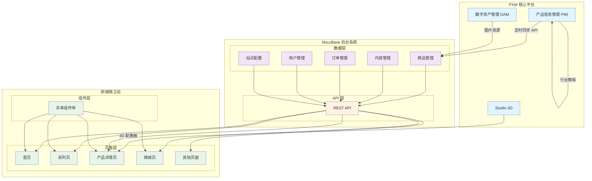
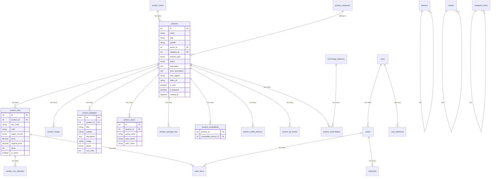
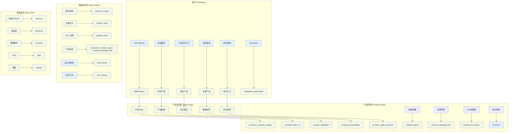
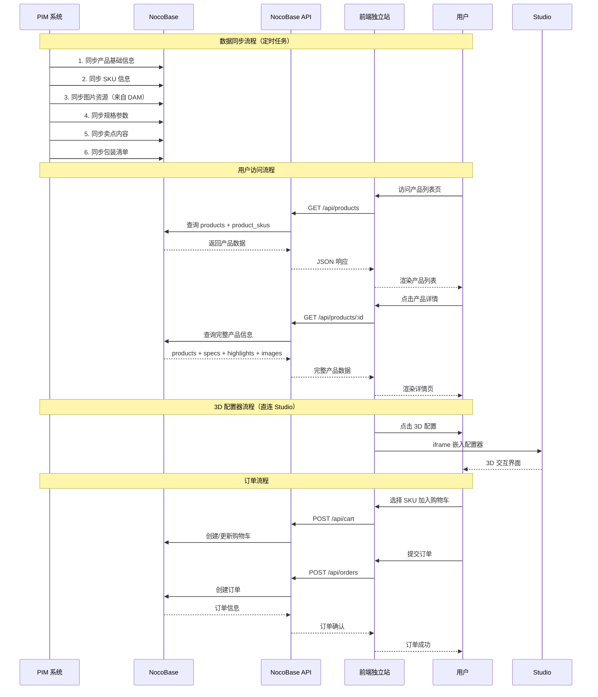
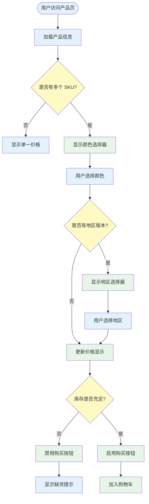
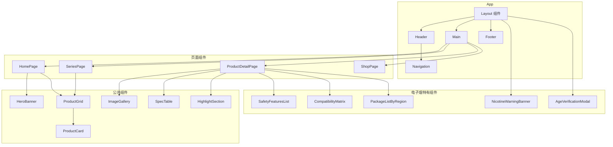
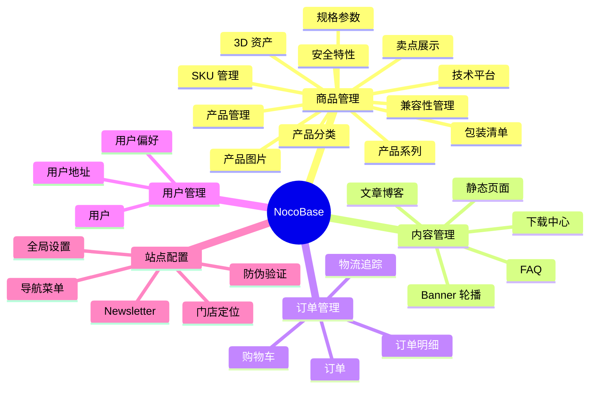

# 电子烟独立站 — 架构可视化图

> 通过图表形式展示电子烟独立站的整体架构，包括：数据流架构、页面结构、表关系、PIM 集成等。
> 帮助快速理解系统全貌。

---

## 一、整体系统架构图



---

## 二、数据表关系图



---

## 三、页面结构与数据映射图



---

## 四、数据流程图（PIM → NocoBase → 前端）



---

## 五、SKU 选择流程图（电子烟行业）



---

## 六、页面组件层次图



---

## 七、NocoBase 模块划分图



---

## 八、部署架构图

```mermaid
graph TB
    subgraph "生产环境"
        subgraph "CDN"
            CDN[静态资源 CDN]
            DAM[DAM 资源]
        end
        
        subgraph "Web 服务器"
            Nginx[Nginx 反向代理]
            Web1[Next.js 服务器 1]
            Web2[Next.js 服务器 2]
        end
        
        subgraph "应用服务器"
            NB1[NocoBase 服务器 1]
            NB2[NocoBase 服务器 2]
            DB[(PostgreSQL)]
            Redis[(Redis 缓存)]
        end
        
        subgraph "PXM 系统"
            PIM_API[PIM API]
            Studio_API[Studio API]
        end
    end
    
    User[用户] --> CDN
    User --> Nginx
    Nginx --> Web1
    Nginx --> Web2
    
    Web1 --> NB1
    Web2 --> NB2
    NB1 --> DB
    NB2 --> DB
    NB1 --> Redis
    NB2 --> Redis
    
    NB1 --> PIM_API
    NB2 --> PIM_API
    
    Web1 --> Studio_API
    Web2 --> Studio_API
    
    CDN --> DAM
    
    classDef user fill:#ffecb3
    classDef cdn fill:#e1f5fe
    classDef web fill:#e8f5e9
    classDef app fill:#f3e5f5
    classDef db fill:#fff3e0
    classDef pxm fill:#ffebee
    
    class User user
    class CDN,DAM cdn
    class Nginx,Web1,Web2 web
    class NB1,NB2,Redis app
    class DB db
    class PIM_API,Studio_API pxm
```

---

## 九、关键数据流说明

### 1. 产品数据流
```
PIM（定义产品） 
  ↓ 定时同步
NocoBase（存储 + API）
  ↓ REST API
前端（渲染页面）
```

### 2. 图片资源流
```
DAM（存储图片）
  ↓ URL 引用
NocoBase（存储 URL）
  ↓ 调用
前端（展示图片）
  ↓ CDN 加速
用户浏览器
```

### 3. 3D 配置器流
```
Studio（3D 场景）
  ↓ 嵌入 URL
前端（iframe 展示）
  ↓ 用户交互
Studio（实时渲染）
```

### 4. 订单数据流
```
用户（下单）
  ↓ API 调用
NocoBase（创建订单）
  ↓ 库存扣减
NocoBase（更新库存）
  ↓ 订单确认
用户（支付）
```

---

## 十、性能优化要点

1. **静态资源 CDN**：产品图片、视频、3D 资源全部走 CDN
2. **API 缓存**：产品列表、分类等常用数据 Redis 缓存
3. **ISR 策略**：Next.js 增量静态生成，产品页预渲染
4. **图片优化**：WebP 格式、响应式图片、懒加载
5. **3D 资源按需加载**：用户点击再加载 3D 配置器

---

## 十一、安全考虑

1. **年龄验证**：首页强制年龄验证弹窗
2. **尼古丁警告**：全站底部固定警告
3. **地区限制**：根据 IP 显示对应地区版本
4. **防伪查询**：独立防伪验证模块
5. **数据加密**：用户信息、订单数据加密存储

---

这份架构图文档从多个维度展示了电子烟独立站的整体结构，应该能帮你更清晰地理解系统全貌。有什么需要进一步说明的地方吗？
