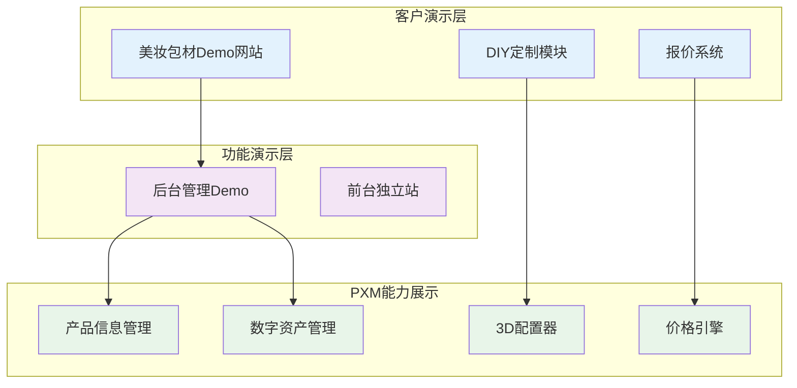
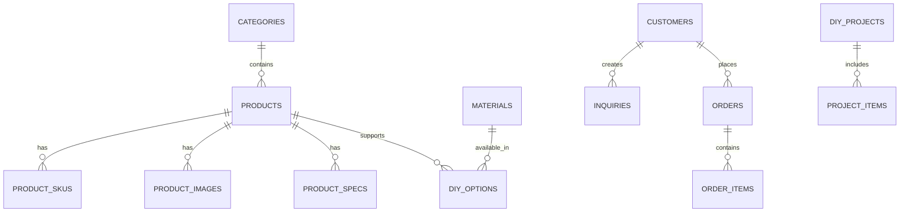

# 美妆包材行业Demo架构设计

> 基于PXM平台能力，展示美妆包材行业的数字化解决方案
> 参考行业网站：李记包装、金雨科技、正庄实业、晟祺实业

---

## 一、项目定位与目标

### 1.1 项目定位
- **行业属性**：美妆包材B2B定制化解决方案
- **演示重点**：展示PXM如何支持定制化业务场景
- **核心价值**：从设计到生产的完整数字化解决方案

### 1.2 演示目标
- **DIY定制能力**：产品形状选择、颜色自定义、设计上传、3D预览
- **B2B业务逻辑**：MOQ定价、样品申请、阶梯报价
- **材质库管理**：玻璃、亚克力、PP等材质的属性管理
- **客户需求响应**：快速响应客户定制需求的全流程展示

---

## 二、整体架构设计

### 2.1 系统架构图



### 2.2 数据流设计

```
PXM平台（产品数据/3D模型/价格规则）
    ↓ API接口
Demo后台（数据管理/订单处理/客户管理）
    ↓ 数据同步
Demo前台（产品展示/DIY定制/报价生成）
    ↓ 用户交互
客户体验（浏览/定制/询价/下单）
```

---

## 三、核心功能模块

### 3.1 产品展示模块

#### 3.1.1 产品分类体系
```
美妆包材
├── 护肤包装
│   ├── 真空瓶系列
│   ├── 乳液瓶系列
│   ├── 膏霜罐系列
│   ├── 喷雾瓶系列
│   └── 套装系列
├── 家清包装
│   ├── 乳液泵系列
│   ├── 微喷系列
│   ├── 手扣式喷雾系列
│   ├── 泡沫泵系列
│   └── 塑料盖子系列
└── 彩妆包装
    ├── 唇彩系列
    ├── 口红管系列
    ├── 化妆笔
    └── 睫毛膏&眼线
```

#### 3.1.2 产品详情展示
- **产品图片**：多角度高清图片、细节特写
- **规格参数**：容量、材质、口径、颜色等
- **3D展示**：360度旋转查看、缩放细节
- **应用场景**：实际使用案例展示
- **相关产品**：配套产品推荐

### 3.2 DIY定制模块

#### 3.2.1 定制流程
```
选择产品 → 选择材质 → 颜色定制 → 设计上传 → 3D预览 → 保存方案 → 询价下单
```

#### 3.2.2 定制功能
- **形状选择**：瓶子/罐子/管状等不同造型
- **材质选择**：玻璃/亚克力/PP/PET/铝等
- **颜色自定义**：标准色卡选择、潘通色号输入
- **设计上传**：Logo上传、图案设计、文字添加
- **3D实时预览**：Realibox 3D配置器集成
- **方案保存**：心愿单功能、方案对比

### 3.3 B2B报价系统

#### 3.3.1 价格体系
- **MOQ设置**：不同产品类别的最小起订量
- **阶梯价格**：数量区间对应不同单价
- **定制费用**：印刷费、开模费、设计费
- **运输成本**：地区、重量、体积计算

#### 3.3.2 报价流程
- **在线询价**：填写需求表单，获取初步报价
- **方案优化**：销售顾问跟进，提供优化建议
- **正式报价**：生成PDF报价单，发送客户
- **订单跟踪**：生产进度、物流状态实时更新

### 3.4 客户服务模块

- **样品申请**：免费样品、付费样品流程
- **技术支持**：产品咨询、定制建议
- **订单管理**：历史订单、复购便利
- **会员体系**：等级权益、积分奖励

---

## 四、技术架构设计

### 4.1 前端技术栈
- **框架**：Next.js 14 (App Router)
- **UI组件**：Tailwind CSS + Headless UI
- **3D渲染**：Realibox Studio SDK
- **国际化**：react-i18next
- **状态管理**：Zustand
- **表单处理**：React Hook Form + Zod

### 4.2 后端技术栈
- **API层**：Next.js API Routes
- **数据库**：PostgreSQL + Prisma ORM
- **文件存储**：AWS S3 / 阿里云OSS
- **缓存**：Redis
- **队列**：Bull Queue (报价计算、3D渲染)

### 4.3 集成方案

#### 4.3.1 PXM平台集成
```typescript
// PXM API集成示例
interface PXMIntegration {
  // 产品数据同步
  syncProducts(): Promise<Product[]>
  // 3D模型获取
  get3DModel(productId: string): Promise<Model3D>
  // 价格计算
  calculatePrice(params: PriceParams): Promise<PriceResult>
}
```

#### 4.3.2 Realibox 3D配置器
```typescript
// 3D配置器集成
interface Configurator3D {
  // 初始化配置器
  init(container: HTMLElement, productId: string): void
  // 更新材质
  updateMaterial(materialId: string): void
  // 更新颜色
  updateColor(color: string): void
  // 添加Logo
  addLogo(logoUrl: string, position: Vector3): void
  // 获取预览图
  getPreview(): Promise<string>
}
```

---

## 五、数据模型设计

### 5.1 核心实体关系



### 5.2 关键数据表

#### 5.2.1 产品表设计要点
- **材质属性**：支持多材质选择
- **定制选项**：形状、颜色、印刷方式
- **3D模型关联**：与PXM Studio的模型ID
- **价格规则**：阶梯价格、MOQ设置

#### 5.2.2 DIY项目表
- **方案数据**：JSON存储定制配置
- **预览图**：多角度渲染图
- **客户关联**：绑定客户信息
- **状态跟踪**：设计/报价/生产/交付

---

## 六、演示流程设计

### 6.1 客户演示路径

1. **产品浏览**（5分钟）
   - 展示产品分类和搜索功能
   - 查看产品详情和3D展示

2. **DIY定制演示**（10分钟）
   - 选择产品进行定制
   - 实时预览定制效果
   - 保存多个方案对比

3. **报价流程演示**（5分钟）
   - 提交定制方案
   - 自动计算价格
   - 生成报价单

4. **后台管理演示**（5分钟）
   - 查看询价信息
   - 处理客户订单
   - 数据分析报表

### 6.2 价值展示点

- **设计效率提升**：从7天缩短到1小时
- **客户体验优化**：所见即所得的定制体验
- **销售转化提高**：3D预览提升成交率
- **生产成本降低**：精确的需求减少浪费

---

## 七、项目实施计划

### 7.1 第一阶段（2周）
- [x] 完成架构设计
- [ ] 搭建基础框架
- [ ] 实现产品展示模块
- [ ] 集成PXM产品数据

### 7.2 第二阶段（3周）
- [ ] 开发DIY定制模块
- [ ] 集成3D配置器
- [ ] 实现报价系统
- [ ] 完善客户服务功能

### 7.3 第三阶段（2周）
- [ ] 优化用户体验
- [ ] 性能优化
- [ ] 测试与调试
- [ ] 部署上线

---

## 八、成功指标

### 8.1 技术指标
- 页面加载速度 < 3秒
- 3D渲染响应时间 < 2秒
- 系统稳定性 > 99%

### 8.2 业务指标
- 客户停留时间 > 10分钟
- DIY方案转化率 > 30%
- 询价转化率 > 50%

### 8.3 演示效果
- 客户满意度 > 4.5/5
- 功能完整性 100%
- PXM价值清晰度 > 90%
