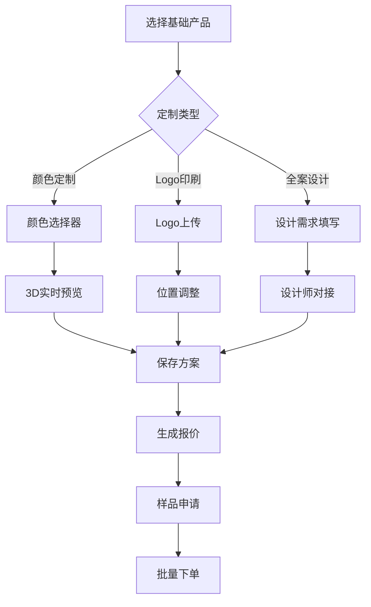
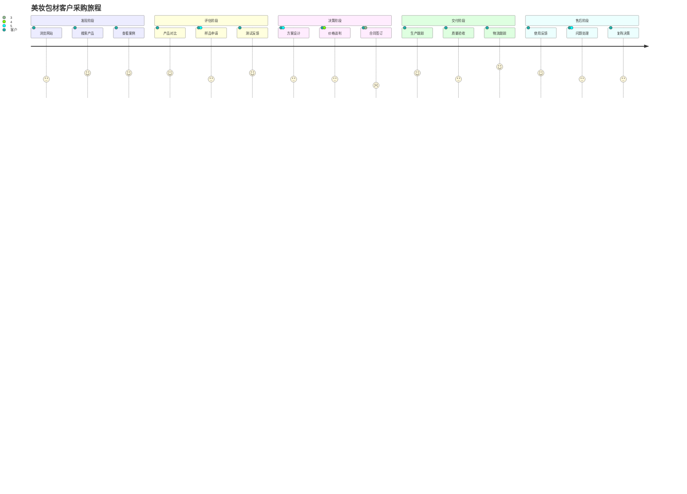

# 美妆包材Demo业务结构设计

> 基于美妆包材行业特点，设计完整的B2B业务流程和功能模块

---

## 一、业务场景分析

### 1.1 目标客户群体
- **品牌方**：新兴美妆品牌、国际品牌亚太区
- **代工厂**：OEM/ODM制造商
- **贸易公司**：品牌代理商、采购服务商
- **设计机构**：包装设计公司、品牌咨询

### 1.2 核心业务需求
- **产品定制**：从标准产品到完全定制化
- **小批量试产**：支持MOQ 500-5000起订
- **快速交付**：设计确认后15-30天交付
- **质量保证**：ISO认证、材料认证

### 1.3 决策流程
```
需求确认 → 产品选型 → 样品测试 → 方案设计 → 价格谈判 → 合同签订 → 生产交付
```

---

## 二、业务模块设计

### 2.1 产品中心

#### 2.1.1 产品体系架构
```
美妆包材产品体系
├── 按用途分类
│   ├── 护肤包装
│   │   ├── 面霜类（真空瓶/膏霜罐）
│   │   ├── 精华类（滴管瓶/喷雾瓶）
│   │   ├── 洁面类（泡沫泵瓶/软管）
│   │   └── 套装系列（旅行装/礼盒装）
│   ├── 彩妆包装
│   │   ├── 底妆类（粉底液瓶/气垫）
│   │   ├── 眼妆类（睫毛膏管/眼线笔）
│   │   ├── 唇妆类（口红管/唇釉管）
│   │   └── 定制类（限量版/联名款）
│   └── 家清包装
│       ├── 洗护类（洗发水瓶/沐浴露瓶）
│       ├── 清洁类（喷雾瓶/泵头瓶）
│       └── 补充装（替换装/大包装）
├── 按材质分类
│   ├── 玻璃系列
│   │   ├── 钠钙玻璃（成本优势）
│   │   ├── 高硼硅玻璃（耐高温）
│   │   └── 水晶玻璃（高端质感）
│   ├── 塑料系列
│   │   ├── PET（环保可回收）
│   │   ├── PP（耐化学性好）
│   │   ├── PE（柔韧性好）
│   │   ├── 亚克力（透明度高）
│   │   └── PETG（环保升级）
│   ├── 金属系列
│   │   ├── 铝制（轻便环保）
│   │   ├── 不锈钢（高端耐用）
│   │   └── 马口铁（复古风格）
│   └── 复合材料
│       ├── 玻塑结合
│       ├── 纸塑复合
│       └── 生物基材料
└── 按工艺分类
    ├── 印刷工艺
    │   ├── 丝网印刷（成本较低）
    │   ├── 胶版印刷（精度高）
    │   ├── 烫金工艺（高端感）
    │   └── UV印刷（环保）
    ├── 表面处理
    │   ├── 喷涂（单色/渐变）
    │   ├── 电镀（金属质感）
    │   ├── 磨砂（哑光效果）
    │   └── 激光雕刻（精细图案）
    └── 装饰工艺
        ├── 贴标（灵活更换）
        ├── 热缩膜（全包覆）
        ├── 手工花饰（高端定制）
        └── 3D打印（异形结构）
```

#### 2.1.2 产品数据结构
```typescript
interface Product {
  // 基础信息
  id: string
  name: string
  series: string
  category: ProductCategory
  tags: string[]
  
  // 规格参数
  capacity: number // 容量(ml)
  material: Material[]
  diameter: number // 口径(mm)
  height: number // 高度(mm)
  weight: number // 重量(g)
  
  // 定制选项
  customizable: {
    color: boolean
    printing: boolean
    logo: boolean
    shape: boolean
    material: boolean
  }
  
  // 商务信息
  moq: number // 最小起订量
  priceRange: {
    min: number
    max: number
  }
  leadTime: number // 交期(天)
  
  // 媒体资源
  images: ProductImage[]
  videos: Video[]
  model3D?: Model3D
  
  // 关联信息
  related: string[] // 关联产品ID
  applications: Application[] // 应用案例
}
```

### 2.2 DIY定制中心

#### 2.2.1 定制流程设计


#### 2.2.2 定制功能模块

**颜色定制模块**
- 标准色卡（潘通色号）
- 自定义颜色上传
- 渐变色效果
- 透明度调节
- 材质纹理选择

**Logo印刷模块**
- 文件上传（AI/PDF/JPG）
- 位置定位（拖拽调整）
- 大小缩放
- 旋转角度
- 效果预览（烫金/银/普通印刷）

**形状定制模块**
- 基础形状库
- 参数化调整
- 异形设计
- 模具费用计算
- 工艺可行性评估

**包装设计模块**
- 外包装设计
- 内衬配置
- 标签设计
- 说明书设计
- 整体方案预览

### 2.3 智能报价系统

#### 2.3.1 价格构成模型
```
总价格 = 产品单价 × 数量 + 定制费 + 模具费 + 运输费 - 优惠折扣

其中：
- 产品单价：基于阶梯价格表
- 定制费：印刷费/设计费/工艺费
- 模具费：新开模具一次性费用
- 运输费：基于重量、体积、目的地
- 优惠折扣：VIP折扣/活动优惠/量大折扣
```

#### 2.3.2 报价规则引擎
```typescript
interface PricingRule {
  // 基础价格规则
  basePrice: {
    ranges: Array<{
      minQty: number
      maxQty: number
      unitPrice: number
    }>
  }
  
  // 定制费用规则
  customization: {
    printing: {
      setupFee: number
      perUnitFee: number
      colors: number[]
    }
    logo: {
      setupFee: number
      complexity: 'simple' | 'complex'
    }
    mold: {
      oneTimeFee: number
      cavities: number
    }
  }
  
  // 优惠规则
  discounts: {
    vip: Array<{ level: number; discount: number }>
    promotion: Array<{ condition: string; discount: number }>
    seasonal: Array<{ period: string; discount: number }>
  }
  
  // 物流规则
  shipping: {
    zones: Array<{
      countries: string[]
      baseFee: number
      perKgFee: number
    }>
  }
}
```

### 2.4 客户管理系统

#### 2.4.1 客户分级体系
```
客户等级
├── 普通客户
│   ├── MOQ: 1000起
│   ├── 付款方式: 100%预付
│   └── 服务: 标准服务
├── VIP客户
│   ├── MOQ: 500起
│   ├── 付款方式: 50%预付
│   ├── 优惠: 95折
│   └── 服务: 专属客服
└── 战略伙伴
    ├── MOQ: 300起
    ├── 付款方式: 30%预付
    ├── 优惠: 9折
    └── 服务: 定制化服务
```

#### 2.4.2 客户服务流程
```typescript
interface CustomerService {
  // 咨询管理
  inquiry: {
    create: (data: InquiryData) => Promise<Inquiry>
    assign: (inquiryId: string, advisorId: string) => Promise<void>
    followUp: (inquiryId: string, note: string) => Promise<void>
  }
  
  // 样品管理
  sample: {
    request: (data: SampleRequest) => Promise<SampleOrder>
    track: (sampleId: string) => Promise<SampleStatus>
    feedback: (sampleId: string, feedback: SampleFeedback) => Promise<void>
  }
  
  // 订单管理
  order: {
    create: (data: OrderData) => Promise<Order>
    updateStatus: (orderId: string, status: OrderStatus) => Promise<void>
    trackProduction: (orderId: string) => Promise<ProductionStatus>
  }
  
  // 售后服务
  afterSales: {
    qualityIssue: (issue: QualityIssue) => Promise<Ticket>
    returnRequest: (request: ReturnRequest) => Promise<RMA>
    complaint: (complaint: Complaint) => Promise<Ticket>
  }
}
```

### 2.5 供应链协同

#### 2.5.1 供应商管理
- **原料供应商**：玻璃厂、塑料粒子厂、涂料厂
- **工艺供应商**：印刷厂、电镀厂、模具厂
- **物流服务商**：海运、空运、快递
- **认证机构**：SGS、Intertek、第三方检测

#### 2.5.2 生产管理
```typescript
interface Production {
  // 生产计划
  planning: {
    schedule: (orderId: string) => Promise<ProductionSchedule>
    capacity: (date: Date) => Promise<CapacityInfo>
    bottleneck: () => Promise<BottleneckAnalysis>
  }
  
  // 进度跟踪
  tracking: {
    update: (orderId: string, stage: ProductionStage) => Promise<void>
    notify: (orderId: string, event: ProductionEvent) => Promise<void>
    report: (orderId: string) => Promise<ProgressReport>
  }
  
  // 质量控制
  quality: {
    inspection: (batchId: string) => Promise<QCReport>
    certification: (productId: string) => Promise<Certificate[]>
    compliance: (market: string) => Promise<ComplianceCheck>
  }
}
```

---

## 三、业务流程设计

### 3.1 客户旅程地图



### 3.2 关键业务流程

#### 3.2.1 快速询价流程
```
1. 客户选择产品 → 2. 配置定制选项 → 3. 系统初步报价 
→ 4. 客户提交需求 → 5. 销售审核调整 → 6. 正式报价单
→ 7. 客户确认 → 8. 转为订单
```

#### 3.2.2 定制开发流程
```
1. 需求沟通 → 2. 设计方案 → 3. 3D效果图 
→ 4. 客户确认 → 5. 打样制作 → 6. 样品寄送
→ 7. 样品测试 → 8. 反馈调整 → 9. 批量生产
```

#### 3.2.3 订单履行流程
```
1. 订单确认 → 2. 采购原料 → 3. 生产排期 
→ 4. 过程质检 → 5. 成品入库 → 6. 物流配送
→ 7. 客户签收 → 8. 售后跟进
```

---

## 四、业务指标体系

### 4.1 销售指标
- **线索转化率**：询价→订单转化率
- **客单价**：平均订单金额
- **复购率**：客户重复购买比例
- **客户生命周期价值**：LTV

### 4.2 运营指标
- **库存周转率**：库存管理效率
- **订单交付周期**：从下单到交付
- **质量合格率**：产品质检通过率
- **客户满意度**：NPS评分

### 4.3 财务指标
- **毛利率**：产品盈利能力
- **获客成本**：CAC
- **投资回报率**：ROI
- **现金流**：资金健康度

---

## 五、差异化竞争优势

### 5.1 技术优势
- **3D在线定制**：所见即所得
- **智能报价**：实时精准报价
- **数字孪生**：产品全生命周期管理
- **区块链溯源**：产品防伪溯源

### 5.2 服务优势
- **快速响应**：24小时内报价
- **小批量支持**：最低500起订
- **一站式服务**：设计到生产全包
- **全球交付**：支持国际物流

### 5.3 生态优势
- **PXM平台赋能**：数字化管理
- **供应链整合**：优质资源聚合
- **设计资源共享**：海量设计模板
- **行业经验沉淀**：最佳实践库
