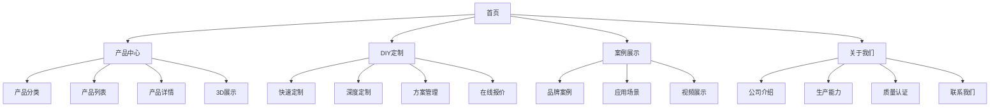
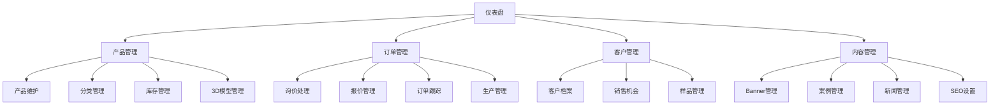
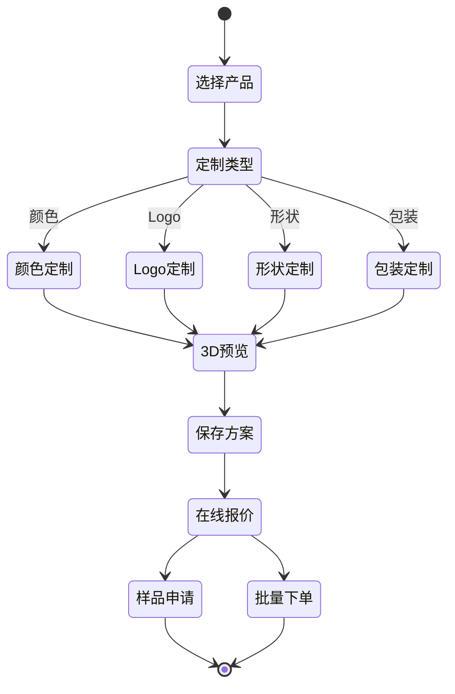
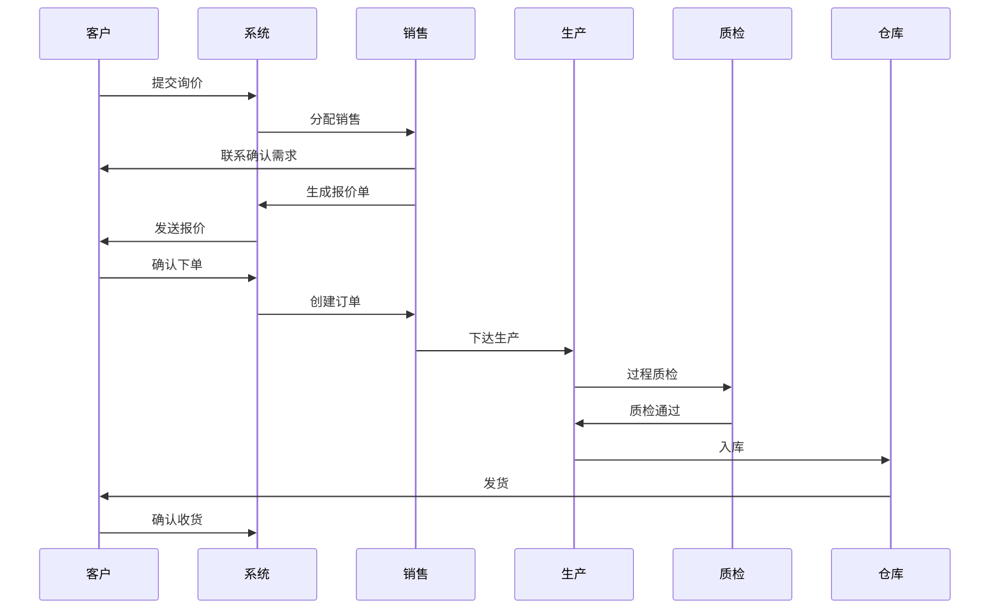

# 美妆包材Demo功能模块设计

> 基于业务需求，设计详细的功能模块和交互流程

---

## 一、功能模块总览

### 1.1 前台功能模块



### 1.2 后台功能模块



---

## 二、前台功能详细设计

### 2.1 首页模块

#### 2.1.1 页面结构
```
┌─────────────────────────────────────┐
│              导航栏                  │
├─────────────────────────────────────┤
│           Hero Banner               │
│     轮播展示核心产品和定制能力        │
├─────────────────────────────────────┤
│          产品分类入口                │
│    护肤/彩妆/家清三大类别快速导航     │
├─────────────────────────────────────┤
│          热门产品展示                │
│     精选产品卡片，支持快速预览        │
├─────────────────────────────────────┤
│          DIY定制展示                 │
│     动态展示定制流程和效果            │
├─────────────────────────────────────┤
│          成功案例                    │
│     合作品牌Logo墙                   │
├─────────────────────────────────────┤
│          公司优势                    │
│     设计/生产/质量/服务四大优势       │
├─────────────────────────────────────┤
│              页脚                    │
└─────────────────────────────────────┘
```

#### 2.1.2 核心功能
- **多语言切换**：中英文一键切换
- **产品搜索**：支持名称、型号、应用场景搜索
- **快速询价**：首页直接进入询价流程
- **在线客服**：悬浮客服窗口，实时答疑

### 2.2 产品中心模块

#### 2.2.1 产品分类页
```typescript
interface CategoryPage {
  // 面包屑导航
  breadcrumb: Array<{
    name: string
    link: string
  }>
  
  // 分类筛选
  filters: {
    categories: Category[]
    materials: Material[]
    capacities: Capacity[]
    applications: Application[]
  }
  
  // 产品列表
  products: {
    layout: 'grid' | 'list'
    sortBy: 'name' | 'price' | 'new' | 'popular'
    pagination: Pagination
    items: ProductCard[]
  }
  
  // 侧边栏
  sidebar: {
    hotProducts: Product[]
    promotionBanner: Banner
    guide: Guide[]
  }
}
```

#### 2.2.2 产品详情页
```
┌─────────────────────────────────────┐
│          产品图片画廊                │
│     多角度图片 + 3D模型入口          │
├─────────────────────────────────────┤
│          基础信息                    │
│  名称/型号/分类/MOQ/交期            │
├─────────────────────────────────────┤
│          规格参数                    │
│     容量/材质/尺寸/重量等详细信息     │
├─────────────────────────────────────┤
│          定制选项                    │
│     可定制内容展示和快速定制入口      │
├─────────────────────────────────────┤
│          应用案例                    │
│     实际使用场景和品牌案例            │
├─────────────────────────────────────┤
│          相关推荐                    │
│     同类产品或配套产品推荐            │
├─────────────────────────────────────┤
│          操作按钮                    │
│     询价/样品/收藏/分享              │
└─────────────────────────────────────┘
```

#### 2.2.3 3D展示功能
```typescript
interface Viewer3D {
  // 基础操作
  controls: {
    rotate: boolean // 旋转
    zoom: boolean   // 缩放
    pan: boolean    // 平移
  }
  
  // 展示模式
  views: {
    default: string    // 默认视角
    angles: string[]   // 预设角度
    animation: string  // 自动旋转
  }
  
  // 材质切换
  materials: {
    current: string    // 当前材质
    options: Material[] // 可选材质
  }
  
  // 测量工具
  measurement: {
    enabled: boolean
    dimensions: Dimension[]
  }
  
  // 截图功能
  screenshot: {
    format: 'png' | 'jpg'
    quality: number
    watermark: boolean
  }
}
```

### 2.3 DIY定制模块

#### 2.3.1 定制流程设计


#### 2.3.2 颜色定制功能
```typescript
interface ColorCustomization {
  // 颜色选择器
  colorPicker: {
    type: 'solid' | 'gradient' | 'transparent'
    palette: ColorPalette[]    // 色卡
    custom: boolean           // 自定义颜色
    pantone: boolean          // 潘通色号
  }
  
  // 材质纹理
  texture: {
    options: Texture[]
    preview: boolean
    intensity: number
  }
  
  // 效果预览
  preview: {
    realTime: boolean    // 实时预览
    angles: string[]     // 多角度
    lighting: LightMode  // 光照模式
  }
  
  // 保存配置
  save: {
    name: string
    notes: string
    share: boolean
  }
}
```

#### 2.3.3 Logo印刷功能
```typescript
interface LogoPrinting {
  // 文件上传
  upload: {
    formats: ['ai', 'pdf', 'eps', 'png', 'jpg']
    maxSize: number      // 最大文件大小
    requirements: string // 设计要求
  }
  
  // 位置调整
  positioning: {
    mode: 'drag' | 'coordinate'  // 拖拽/坐标
    snap: boolean                // 吸附
    guides: boolean              // 参考线
    lockRatio: boolean           // 锁定比例
  }
  
  // 印刷效果
  printing: {
    methods: PrintingMethod[]    // 印刷工艺
    colors: number              // 颜色数量
    preview: boolean            // 效果预览
    cost: number                // 费用计算
  }
  
  // 3D预览
  preview3D: {
    model: string
    position: Vector3
    rotation: Vector3
    scale: number
  }
}
```

### 2.4 智能报价模块

#### 2.4.1 报价计算器
```typescript
interface QuoteCalculator {
  // 基础配置
  base: {
    product: Product
    quantity: number
    delivery: DeliveryOption
  }
  
  // 定制费用
  customization: {
    colorCost: number
    printingCost: number
    logoCost: number
    moldCost: number
  }
  
  // 价格阶梯
  tiers: Array<{
    minQty: number
    maxQty: number
    unitPrice: number
    savings: string
  }>
  
  // 费用明细
  breakdown: {
    subtotal: number
    customization: number
    tooling: number
    shipping: number
    discount: number
    total: number
  }
  
  // 交期选项
  leadTime: {
    standard: number
    express: number
    extraCost: number
  }
}
```

#### 2.4.2 报价单生成
```typescript
interface Quotation {
  // 报价单信息
  info: {
    quoteNo: string
    date: Date
    validUntil: Date
    salesRep: string
  }
  
  // 客户信息
  customer: Customer
  
  // 产品明细
  items: QuotationItem[]
  
  // 商务条款
  terms: {
    payment: string
    delivery: string
    warranty: string
  }
  
  // 导出选项
  export: {
    pdf: boolean
    excel: boolean
    email: boolean
  }
}
```

### 2.5 客户中心模块

#### 2.5.1 个人中心
```typescript
interface CustomerPortal {
  // 账户信息
  profile: {
    company: CompanyInfo
    contacts: Contact[]
    addresses: Address[]
    preferences: Preferences
  }
  
  // 我的方案
  projects: {
    list: DIYProject[]
    filters: Filter[]
    sharing: ShareLink[]
  }
  
  // 询价记录
  inquiries: {
    list: Inquiry[]
    status: Status
    followUp: FollowUp[]
  }
  
  // 订单管理
  orders: {
    list: Order[]
    tracking: Tracking
    documents: Document[]
  }
  
  // 样品管理
  samples: {
    requests: SampleRequest[]
    history: SampleHistory[]
    feedback: Feedback[]
  }
}
```

---

## 三、后台功能详细设计

### 3.1 仪表盘

#### 3.1.1 数据概览
```typescript
interface Dashboard {
  // 核心指标
  kpis: {
    inquiries: {
      total: number
      today: number
      conversion: number
    }
    orders: {
      total: number
      value: number
      pending: number
    }
    production: {
      active: number
      delayed: number
      completed: number
    }
    revenue: {
      month: number
      quarter: number
      growth: number
    }
  }
  
  // 图表展示
  charts: {
    salesTrend: ChartData
    productMix: PieData
    customerDistribution: MapData
    productionStatus: GanttData
  }
  
  // 待办事项
  tasks: {
    inquiries: Inquiry[]
    quotes: Quotation[]
    orders: Order[]
    issues: Issue[]
  }
  
  // 快捷入口
  shortcuts: {
    addProduct: string
    createQuote: string
    viewOrders: string
    manageCustomers: string
  }
}
```

### 3.2 产品管理

#### 3.2.1 产品编辑器
```typescript
interface ProductEditor {
  // 基础信息
  basic: {
    name: string
    category: Category
    series: string
    model: string
    tags: string[]
  }
  
  // 规格参数
  specs: {
    template: SpecTemplate
    custom: Spec[]
    validation: Validation
  }
  
  // 媒体资源
  media: {
    images: ImageManager
    videos: VideoManager
    models3D: Model3DManager
    documents: DocumentManager
  }
  
  // 定制配置
  customization: {
    options: DIYOption[]
    rules: CustomRule[]
    constraints: Constraint[]
  }
  
  // 商务信息
  commercial: {
    moq: number
    leadTime: number
    pricing: PriceTier[]
    costs: CostBreakdown
  }
  
  // SEO设置
  seo: {
    title: string
    description: string
    keywords: string[]
    ogImage: string
  }
}
```

#### 3.2.2 库存管理
```typescript
interface InventoryManager {
  // 库存概览
  overview: {
    totalValue: number
    lowStock: Product[]
    outOfStock: Product[]
    excessStock: Product[]
  }
  
  // 库存调整
  adjustment: {
    type: 'in' | 'out' | 'adjust'
    quantity: number
    reason: string
    approval: boolean
  }
  
  // 库存预警
  alerts: {
    enabled: boolean
    thresholds: {
      low: number
      high: number
    }
    notifications: Notification[]
  }
  
  // 库存报表
  reports: {
    turnover: Report
    valuation: Report
    movement: Report
    forecast: Forecast
  }
}
```

### 3.3 订单管理

#### 3.3.1 订单处理流程


#### 3.3.2 生产跟踪
```typescript
interface ProductionTracking {
  // 生产计划
  planning: {
    schedule: ProductionSchedule
    capacity: CapacityPlan
    resources: Resource[]
  }
  
  // 进度更新
  progress: {
    currentStep: ProductionStep
    completedSteps: Step[]
    estimatedCompletion: Date
    delayReason?: string
  }
  
  // 异常处理
  exceptions: {
    type: ExceptionType
    description: string
    impact: Impact
    resolution: Resolution
  }
  
  // 客户通知
  notifications: {
    milestones: Milestone[]
    custom: CustomMessage[]
    auto: AutoNotification[]
  }
}
```

### 3.4 内容管理

#### 3.4.1 案例管理
```typescript
interface CaseStudyManager {
  // 案例信息
  case: {
    title: string
    brand: string
    category: string
    tags: string[]
    date: Date
  }
  
  // 内容编辑
  content: {
    summary: RichText
    challenge: RichText
    solution: RichText
    result: RichText
  }
  
  // 媒体资源
  media: {
    hero: Image
    gallery: Image[]
    video: Video
    testimonial: Testimonial
  }
  
  // 产品关联
  products: {
    used: Product[]
    recommended: Product[]
  }
  
  // SEO优化
  seo: {
    slug: string
    meta: MetaData
    schema: SchemaMarkup
  }
}
```

---

## 四、特色功能设计

### 4.1 AI智能推荐

```typescript
interface AIRecommendation {
  // 产品推荐
  productRecommendation: {
    basedOn: 'view' | 'search' | 'purchase' | 'similar'
    algorithm: 'collaborative' | 'content' | 'hybrid'
    results: Product[]
    confidence: number
  }
  
  // 定制建议
  customizationSuggestion: {
    popular: Customization[]
    trending: Trend[]
    personalized: PersonalizedOption[]
  }
  
  // 价格优化
  priceOptimization: {
    alternatives: Product[]
    savings: number
    tradeoffs: string[]
  }
}
```

### 4.2 AR试看功能

```typescript
interface ARPreview {
  // 设备支持
  deviceSupport: {
    camera: boolean
    ar: boolean
    tracking: boolean
  }
  
  // 预览模式
  previewModes: {
    handheld: boolean  // 手持预览
    tabletop: boolean  // 桌面预览
    space: boolean     // 空间预览
  }
  
  // 交互功能
  interactions: {
    rotate: boolean
    scale: boolean
    colorChange: boolean
    logoPlacement: boolean
  }
  
  // 分享功能
  sharing: {
    screenshot: boolean
    video: boolean
    social: SocialPlatform[]
  }
}
```

### 4.3 实时协作

```typescript
interface RealTimeCollaboration {
  // 多人协作
  collaboration: {
    session: CollaborationSession
    participants: Participant[]
    permissions: Permission[]
  }
  
  // 实时同步
  sync: {
    changes: Change[]
    conflicts: Conflict[]
    resolution: Resolution
  }
  
  // 沟通工具
  communication: {
    chat: ChatMessage[]
    voice: VoiceCall
    video: VideoCall
    annotation: Annotation[]
  }
  
  // 版本管理
  versioning: {
    history: Version[]
    compare: CompareView
    rollback: Rollback
  }
}
```

---

## 五、移动端适配

### 5.1 响应式设计

```typescript
interface ResponsiveDesign {
  // 断点设置
  breakpoints: {
    mobile: 320-768px
    tablet: 768-1024px
    desktop: 1024px+
  }
  
  // 布局调整
  layouts: {
    navigation: 'bottom' | 'hamburger' | 'top'
    content: 'single' | 'double' | 'grid'
    sidebar: 'overlay' | 'push' | 'none'
  }
  
  // 交互优化
  interactions: {
    touch: boolean
    gestures: Gesture[]
    haptic: boolean
  }
  
  // 性能优化
  optimization: {
    lazyLoad: boolean
    imageOptimization: boolean
    bundleSize: number
  }
}
```

### 5.2 PWA支持

```typescript
interface PWAFeatures {
  // 离线功能
  offline: {
    caching: CacheStrategy
    sync: BackgroundSync
    fallback: FallbackPage
  }
  
  // 原生体验
  native: {
    install: InstallPrompt
    splash: SplashScreen
    notifications: PushNotification
  }
  
  // 性能监控
  monitoring: {
    performance: PerformanceMetrics
    errors: ErrorTracking
    analytics: Analytics
  }
}
```

---

## 六、性能优化

### 6.1 前端优化

- **代码分割**：按路由和功能模块分割
- **懒加载**：图片、组件、路由懒加载
- **缓存策略**：浏览器缓存、CDN缓存、Service Worker
- **资源优化**：图片压缩、字体优化、CSS/JS压缩

### 6.2 后端优化

- **数据库优化**：索引优化、查询优化、连接池
- **API优化**：GraphQL、批量查询、字段选择
- **缓存层**：Redis缓存、查询缓存、会话缓存
- **异步处理**：队列系统、定时任务、事件驱动

---

## 七、安全设计

### 7.1 认证授权

```typescript
interface AuthSystem {
  // 认证方式
  authentication: {
    local: LocalAuth
    oauth: OAuthProvider[]
    sso: SSOProvider[]
    mfa: MFAProvider[]
  }
  
  // 权限控制
  authorization: {
    rbac: RoleBasedAccess
    abac: AttributeBasedAccess
    api: APIKeyAuth
  }
  
  // 会话管理
  session: {
    timeout: number
    refresh: boolean
    concurrent: number
  }
}
```

### 7.2 数据安全

- **传输加密**：HTTPS、WSS
- **存储加密**：敏感字段加密
- **访问控制**：数据脱敏、访问审计
- **备份恢复**：定期备份、快速恢复
