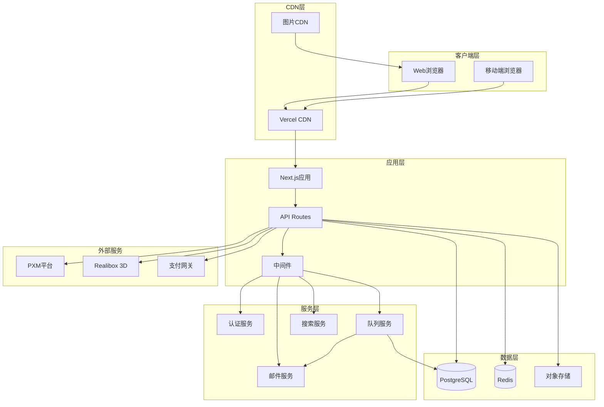
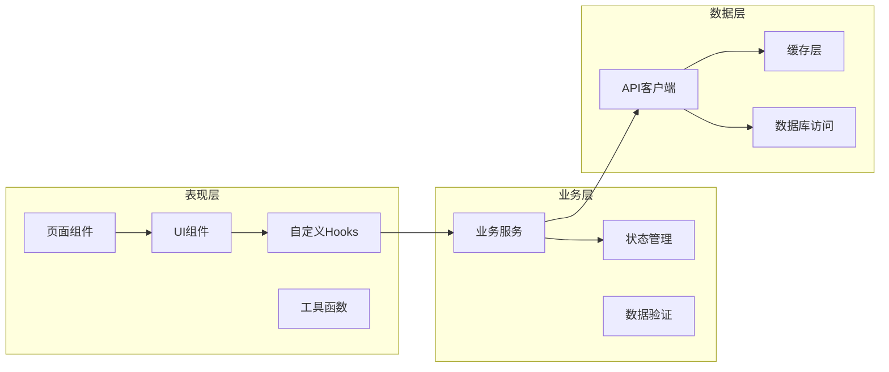

# 美妆包材Demo技术架构设计

> 基于现代技术栈，设计高性能、可扩展的系统架构

---

## 一、技术栈选型

### 1.1 前端技术栈

| 技术领域 | 选型 | 版本 | 说明 |
|---------|------|------|------|
| **框架** | Next.js | 14.x | App Router，支持SSR/SSG |
| **UI框架** | Tailwind CSS | 3.x | 原子化CSS，快速开发 |
| **组件库** | Headless UI | 1.x | 无样式组件库 |
| **状态管理** | Zustand | 4.x | 轻量级状态管理 |
| **表单处理** | React Hook Form | 7.x | 高性能表单库 |
| **数据验证** | Zod | 3.x | TypeScript优先验证 |
| **3D渲染** | Three.js | 0.150+ | 3D场景渲染 |
| **国际化** | react-i18next | 13.x | 多语言支持 |
| **图表库** | Recharts | 2.x | React图表库 |
| **动画库** | Framer Motion | 10.x | 声明式动画 |

### 1.2 后端技术栈

| 技术领域 | 选型 | 版本 | 说明 |
|---------|------|------|------|
| **运行时** | Node.js | 20.x | LTS版本 |
| **框架** | Next.js API Routes | 14.x | 全栈框架 |
| **数据库** | PostgreSQL | 15.x | 关系型数据库 |
| **ORM** | Prisma | 5.x | 现代化ORM |
| **缓存** | Redis | 7.x | 内存数据库 |
| **队列** | Bull Queue | 4.x | 任务队列 |
| **文件存储** | AWS S3 | - | 对象存储 |
| **搜索引擎** | Algolia | - | 全文搜索 |
| **邮件服务** | SendGrid | - | 事务邮件 |

### 1.3 DevOps技术栈

| 技术领域 | 选型 | 说明 |
|---------|------|------|
| **容器化** | Docker | 应用容器化 |
| **编排** | Docker Compose | 本地开发环境 |
| **CI/CD** | GitHub Actions | 自动化部署 |
| **监控** | Sentry | 错误监控 |
| **分析** | Google Analytics | 用户行为分析 |
| **性能** | Vercel Analytics | 性能监控 |

---

## 二、系统架构图

### 2.1 整体架构



### 2.2 应用架构



---

## 三、核心模块设计

### 3.1 3D定制模块

#### 3.1.1 技术实现
```typescript
// 3D配置器核心接口
interface Configurator3D {
  // 初始化
  init(container: HTMLElement, options: ConfigOptions): Promise<void>
  
  // 产品加载
  loadProduct(productId: string): Promise<Product3D>
  
  // 材质切换
  changeMaterial(materialId: string): void
  
  // 颜色更新
  updateColor(color: Color): void
  
  // Logo应用
  applyLogo(config: LogoConfig): void
  
  // 场景渲染
  render(): void
  
  // 截图导出
  captureScreenshot(options: ScreenshotOptions): Promise<string>
  
  // 销毁实例
  dispose(): void
}

// Three.js实现示例
class ThreeJSConfigurator implements Configurator3D {
  private scene: THREE.Scene
  private camera: THREE.PerspectiveCamera
  private renderer: THREE.WebGLRenderer
  private controls: OrbitControls
  private product: Group
  
  async init(container: HTMLElement, options: ConfigOptions) {
    // 场景初始化
    this.scene = new THREE.Scene()
    this.scene.background = new THREE.Color(0xf0f0f0)
    
    // 相机设置
    this.camera = new THREE.PerspectiveCamera(
      75,
      container.clientWidth / container.clientHeight,
      0.1,
      1000
    )
    this.camera.position.set(0, 1, 2)
    
    // 渲染器配置
    this.renderer = new THREE.WebGLRenderer({ antialias: true })
    this.renderer.setSize(container.clientWidth, container.clientHeight)
    this.renderer.shadowMap.enabled = true
    container.appendChild(this.renderer.domElement)
    
    // 控制器
    this.controls = new OrbitControls(this.camera, this.renderer.domElement)
    this.controls.enableDamping = true
    
    // 光照设置
    this.setupLighting()
    
    // 开始渲染循环
    this.animate()
  }
  
  private setupLighting() {
    // 环境光
    const ambientLight = new THREE.AmbientLight(0xffffff, 0.6)
    this.scene.add(ambientLight)
    
    // 方向光
    const directionalLight = new THREE.DirectionalLight(0xffffff, 0.8)
    directionalLight.position.set(5, 10, 5)
    directionalLight.castShadow = true
    this.scene.add(directionalLight)
    
    // 软阴影
    const softLight = new THREE.DirectionalLight(0xffffff, 0.3)
    softLight.position.set(-5, 5, -5)
    this.scene.add(softLight)
  }
}
```

#### 3.1.2 性能优化
```typescript
// 3D模型优化策略
interface ModelOptimization {
  // LOD（细节层次）
  lod: {
    levels: LODLevel[]
    distance: number[]
    autoUpdate: boolean
  }
  
  // 材质合并
  materialMerging: {
    enabled: boolean
    maxMaterials: number
  }
  
  // 纹理压缩
  textureCompression: {
    format: 'dxt' | 'astc' | 'etc2'
    quality: 'low' | 'medium' | 'high'
  }
  
  // 几何体简化
  geometrySimplification: {
    ratio: number
    preserveUVs: boolean
  }
}
```

### 3.2 智能报价引擎

#### 3.2.1 规则引擎设计
```typescript
// 报价规则引擎
class PricingEngine {
  private rules: PricingRule[]
  
  constructor(rules: PricingRule[]) {
    this.rules = rules
  }
  
  // 计算价格
  calculate(params: PricingParams): PricingResult {
    let basePrice = 0
    let adjustments: Adjustment[] = []
    
    // 应用基础价格规则
    const baseRule = this.findRule('base_price', params)
    if (baseRule) {
      basePrice = baseRule.calculate(params)
    }
    
    // 应用调整规则
    for (const rule of this.rules) {
      if (rule.type !== 'base_price' && rule.matches(params)) {
        const adjustment = rule.apply(basePrice, params)
        adjustments.push(adjustment)
        basePrice += adjustment.amount
      }
    }
    
    return {
      basePrice,
      adjustments,
      totalPrice: basePrice,
      currency: params.currency
    }
  }
  
  // 添加规则
  addRule(rule: PricingRule): void {
    this.rules.push(rule)
  }
  
  // 移除规则
  removeRule(ruleId: string): void {
    this.rules = this.rules.filter(r => r.id !== ruleId)
  }
}

// 价格规则定义
interface PricingRule {
  id: string
  name: string
  type: 'base_price' | 'discount' | 'surcharge' | 'tax'
  conditions: Condition[]
  action: Action
  priority: number
}

// 条件匹配
interface Condition {
  field: string
  operator: 'eq' | 'gt' | 'lt' | 'gte' | 'lte' | 'in' | 'between'
  value: any
}

// 动作执行
interface Action {
  type: 'fixed' | 'percentage' | 'formula'
  value: number | string
}
```

#### 3.2.2 缓存策略
```typescript
// 报价缓存管理
class PricingCache {
  private redis: Redis
  private ttl: number = 3600 // 1小时
  
  constructor(redis: Redis) {
    this.redis = redis
  }
  
  // 生成缓存键
  private getCacheKey(params: PricingParams): string {
    const hash = crypto
      .createHash('md5')
      .update(JSON.stringify(params))
      .digest('hex')
    return `pricing:${hash}`
  }
  
  // 获取缓存
  async get(params: PricingParams): Promise<PricingResult | null> {
    const key = this.getCacheKey(params)
    const cached = await this.redis.get(key)
    return cached ? JSON.parse(cached) : null
  }
  
  // 设置缓存
  async set(params: PricingParams, result: PricingResult): Promise<void> {
    const key = this.getCacheKey(params)
    await this.redis.setex(key, this.ttl, JSON.stringify(result))
  }
  
  // 清除缓存
  async invalidate(pattern: string): Promise<void> {
    const keys = await this.redis.keys(`pricing:*${pattern}*`)
    if (keys.length > 0) {
      await this.redis.del(...keys)
    }
  }
}
```

### 3.3 实时协作系统

#### 3.3.1 WebSocket实现
```typescript
// WebSocket服务
class CollaborationService {
  private io: Server
  private sessions: Map<string, CollaborationSession>
  
  constructor(server: http.Server) {
    this.io = new Server(server, {
      cors: {
        origin: process.env.NEXT_PUBLIC_APP_URL
      }
    })
    this.sessions = new Map()
    this.setupEventHandlers()
  }
  
  private setupEventHandlers() {
    this.io.on('connection', (socket) => {
      // 加入会话
      socket.on('join-session', async (data) => {
        const { sessionId, userId } = data
        const session = await this.getSession(sessionId)
        
        if (session && session.canJoin(userId)) {
          socket.join(sessionId)
          socket.userId = userId
          socket.sessionId = sessionId
          
          // 通知其他用户
          socket.to(sessionId).emit('user-joined', {
            userId,
            timestamp: new Date()
          })
          
          // 发送当前状态
          socket.emit('session-state', session.getState())
        }
      })
      
      // 同步操作
      socket.on('operation', async (data) => {
        const { operation, sessionId } = data
        const session = this.sessions.get(sessionId)
        
        if (session) {
          // 应用操作
          const result = await session.applyOperation(operation)
          
          // 广播给其他用户
          socket.to(sessionId).emit('operation-applied', {
            operation,
            result,
            userId: socket.userId
          })
        }
      })
      
      // 断开连接
      socket.on('disconnect', () => {
        if (socket.sessionId) {
          socket.to(socket.sessionId).emit('user-left', {
            userId: socket.userId,
            timestamp: new Date()
          })
        }
      })
    })
  }
  
  private async getSession(sessionId: string): Promise<CollaborationSession | null> {
    if (this.sessions.has(sessionId)) {
      return this.sessions.get(sessionId)!
    }
    
    // 从数据库加载会话
    const session = await CollaborationSession.findById(sessionId)
    if (session) {
      this.sessions.set(sessionId, session)
    }
    
    return session
  }
}
```

#### 3.3.2 冲突解决
```typescript
// 操作转换算法
class OperationalTransform {
  // 转换操作
  transform(op1: Operation, op2: Operation): [Operation, Operation] {
    if (op1.type === 'insert' && op2.type === 'insert') {
      return this.transformInsertInsert(op1, op2)
    } else if (op1.type === 'delete' && op2.type === 'delete') {
      return this.transformDeleteDelete(op1, op2)
    } else if (op1.type === 'insert' && op2.type === 'delete') {
      return this.transformInsertDelete(op1, op2)
    } else {
      return this.transformDeleteInsert(op1, op2)
    }
  }
  
  private transformInsertInsert(op1: InsertOp, op2: InsertOp): [InsertOp, InsertOp] {
    if (op1.position <= op2.position) {
      return [
        op1,
        { ...op2, position: op2.position + op1.text.length }
      ]
    } else {
      return [
        { ...op1, position: op1.position + op2.text.length },
        op2
      ]
    }
  }
  
  private transformDeleteDelete(op1: DeleteOp, op2: DeleteOp): [DeleteOp, DeleteOp] {
    if (op1.position + op1.length <= op2.position) {
      return [
        op1,
        { ...op2, position: op2.position - op1.length }
      ]
    } else if (op2.position + op2.length <= op1.position) {
      return [
        { ...op1, position: op1.position - op2.length },
        op2
      ]
    } else {
      // 重叠删除，需要特殊处理
      return this.handleOverlappingDeletes(op1, op2)
    }
  }
}
```

---

## 四、数据架构设计

### 4.1 数据库设计

#### 4.1.1 Prisma Schema
```prisma
// schema.prisma
generator client {
  provider = "prisma-client-js"
}

datasource db {
  provider = "postgresql"
  url      = env("DATABASE_URL")
}

model Product {
  id          Int      @id @default(autoincrement())
  name        String
  slug        String   @unique
  categoryId  Int
  category    Category @relation(fields: [categoryId], references: [id])
  skus        ProductSku[]
  images      ProductImage[]
  specs       ProductSpec[]
  diyOptions  DIYOption[]
  models3D    Model3D[]
  inquiries   InquiryItem[]
  quotes      QuotationItem[]
  orders      OrderItem[]
  createdAt   DateTime @default(now())
  updatedAt   DateTime @updatedAt
  
  @@map("products")
}

model ProductSku {
  id        Int      @id @default(autoincrement())
  productId Int
  product   Product  @relation(fields: [productId], references: [id])
  skuCode   String   @unique
  capacity  Int?
  color     String?
  material  String?
  price     Decimal
  isActive  Boolean  @default(true)
  
  @@map("product_skus")
}

model DIYProject {
  id           Int         @id @default(autoincrement())
  projectCode  String      @unique
  customerId   Int?
  customer     Customer?   @relation(fields: [customerId], references: [id])
  productId    Int
  product      Product     @relation(fields: [productId], references: [id])
  name         String
  configuration Json       // 定制配置
  previewImages Json       // 预览图数组
  status       ProjectStatus @default(DRAFT)
  createdAt    DateTime    @default(now())
  updatedAt    DateTime    @updatedAt
  
  items        ProjectItem[]
  
  @@map("diy_projects")
}

enum ProjectStatus {
  DRAFT
  SUBMITTED
  QUOTED
  ORDERED
  PRODUCED
}
```

#### 4.1.2 索引优化
```sql
-- 复合索引
CREATE INDEX idx_products_category_status ON products(category_id, status);
CREATE INDEX idx_skus_product_active ON product_skus(product_id, is_active);
CREATE INDEX idx_projects_customer_status ON diy_projects(customer_id, status);

-- 部分索引
CREATE INDEX idx_active_products ON products(id) WHERE status = 'published';
CREATE INDEX idx_recent_orders ON orders(created_at) WHERE created_at > NOW() - INTERVAL '30 days';

-- 全文搜索索引
CREATE INDEX idx_products_search ON products USING gin(to_tsvector('english', name || ' ' || description));
```

### 4.2 缓存架构

#### 4.2.1 多级缓存
```typescript
// 缓存层级
class CacheManager {
  private l1Cache: Map<string, any> = new Map() // 内存缓存
  private l2Cache: Redis // Redis缓存
  private l3Cache: CloudflareKV // 边缘缓存
  
  // 获取缓存
  async get(key: string): Promise<any> {
    // L1缓存
    if (this.l1Cache.has(key)) {
      return this.l1Cache.get(key)
    }
    
    // L2缓存
    const l2Value = await this.l2Cache.get(key)
    if (l2Value) {
      this.l1Cache.set(key, JSON.parse(l2Value))
      return JSON.parse(l2Value)
    }
    
    // L3缓存
    const l3Value = await this.l3Cache.get(key)
    if (l3Value) {
      const value = JSON.parse(l3Value)
      await this.l2Cache.setex(key, 3600, l3Value)
      this.l1Cache.set(key, value)
      return value
    }
    
    return null
  }
  
  // 设置缓存
  async set(key: string, value: any, ttl: number = 3600): Promise<void> {
    const serialized = JSON.stringify(value)
    
    // 设置所有层级
    this.l1Cache.set(key, value)
    await this.l2Cache.setex(key, ttl, serialized)
    await this.l3Cache.put(key, serialized, { expirationTtl: ttl })
  }
}
```

#### 4.2.2 缓存策略
```typescript
// 缓存策略配置
const cacheStrategies = {
  // 产品数据
  product: {
    ttl: 3600, // 1小时
    tags: ['product'],
    invalidation: 'on-update'
  },
  
  // 用户会话
  session: {
    ttl: 86400, // 24小时
    tags: ['session'],
    invalidation: 'on-logout'
  },
  
  // 报价结果
  pricing: {
    ttl: 1800, // 30分钟
    tags: ['pricing'],
    invalidation: 'on-price-change'
  },
  
  // 3D模型
  model3d: {
    ttl: 604800, // 7天
    tags: ['3d', 'model'],
    invalidation: 'manual'
  }
}
```

---

## 五、API设计

### 5.1 RESTful API

#### 5.1.1 API路由设计
```typescript
// API路由结构
/api/v1/
├── auth/
│   ├── POST /login
│   ├── POST /logout
│   ├── POST /refresh
│   └── POST /register
├── products/
│   ├── GET /
│   ├── GET /:id
│   ├── GET /:id/3d-model
│   └── GET /search
├── diy/
│   ├── POST /projects
│   ├── GET /projects/:id
│   ├── PUT /projects/:id
│   └── POST /projects/:id/render
├── quotes/
│   ├── POST /
│   ├── GET /:id
│   └── POST /:id/accept
└── orders/
    ├── POST /
    ├── GET /:id
    ├── PUT /:id/status
    └── GET /:id/tracking
```

#### 5.1.2 API中间件
```typescript
// 认证中间件
export const authMiddleware = async (
  req: NextApiRequest,
  res: NextApiResponse,
  next: NextFunction
) => {
  const token = req.headers.authorization?.replace('Bearer ', '')
  
  if (!token) {
    return res.status(401).json({ error: 'No token provided' })
  }
  
  try {
    const decoded = jwt.verify(token, process.env.JWT_SECRET!)
    req.user = decoded
    next()
  } catch (error) {
    return res.status(401).json({ error: 'Invalid token' })
  }
}

// 限流中间件
export const rateLimitMiddleware = rateLimit({
  windowMs: 15 * 60 * 1000, // 15分钟
  max: 100, // 最多100个请求
  message: 'Too many requests',
  standardHeaders: true,
  legacyHeaders: false
})

// 缓存中间件
export const cacheMiddleware = (ttl: number = 300) => {
  return async (req: NextApiRequest, res: NextApiResponse, next: NextFunction) => {
    const key = `api:${req.url}`
    const cached = await redis.get(key)
    
    if (cached) {
      return res.json(JSON.parse(cached))
    }
    
    // 重写res.json以缓存响应
    const originalJson = res.json
    res.json = function(data) {
      redis.setex(key, ttl, JSON.stringify(data))
      return originalJson.call(this, data)
    }
    
    next()
  }
}
```

### 5.2 GraphQL API

#### 5.2.1 Schema设计
```graphql
type Product {
  id: ID!
  name: String!
  slug: String!
  category: Category!
  skus: [ProductSku!]!
  images: [ProductImage!]!
  specs: [ProductSpec!]!
  diyOptions: [DIYOption!]!
  model3D: Model3D
}

type DIYProject {
  id: ID!
  projectCode: String!
  customer: Customer
  product: Product!
  name: String!
  configuration: JSON!
  previewImages: [String!]!
  status: ProjectStatus!
  createdAt: DateTime!
  updatedAt: DateTime!
}

type Query {
  products(filter: ProductFilter, sort: ProductSort, pagination: Pagination): ProductConnection!
  product(id: ID!): Product
  diyProjects(customerId: ID, status: ProjectStatus): [DIYProject!]!
  calculatePricing(params: PricingParams!): PricingResult!
}

type Mutation {
  createDIYProject(input: CreateDIYProjectInput!): DIYProject!
  updateDIYProject(id: ID!, input: UpdateDIYProjectInput!): DIYYProject!
  submitQuote(input: SubmitQuoteInput!): Quotation!
  createOrder(input: CreateOrderInput!): Order!
}
```

#### 5.2.2 解析器实现
```typescript
// 产品查询解析器
export const productResolvers = {
  Query: {
    products: async (
      parent: any,
      { filter, sort, pagination }: any,
      context: Context
    ) => {
      const where = buildWhereClause(filter)
      const orderBy = buildOrderBy(sort)
      
      const [products, totalCount] = await Promise.all([
        prisma.product.findMany({
          where,
          orderBy,
          ...pagination
        }),
        prisma.product.count({ where })
      ])
      
      return {
        edges: products.map(product => ({
          node: product,
          cursor: product.id
        })),
        pageInfo: {
          hasNextPage: pagination.skip + pagination.limit < totalCount,
          endCursor: products[products.length - 1]?.id
        },
        totalCount
      }
    }
  },
  
  Product: {
    category: async (parent: Product) => {
      return prisma.category.findUnique({
        where: { id: parent.categoryId }
      })
    },
    
    model3D: async (parent: Product) => {
      return prisma.model3D.findFirst({
        where: { productId: parent.id }
      })
    }
  }
}
```

---

## 六、性能优化

### 6.1 前端优化

#### 6.1.1 代码分割
```typescript
// 路由级别代码分割
const ProductDetail = dynamic(
  () => import('@/components/products/ProductDetail'),
  {
    loading: () => <ProductDetailSkeleton />,
    ssr: false // 3D组件客户端渲染
  }
)

// 组件级别代码分割
const Configurator3D = dynamic(
  () => import('@/components/3d/Configurator3D'),
  {
    loading: () => <div>Loading 3D...</div>
  }
)

// 条件加载
const AdminPanel = dynamic(
  () => import('@/components/admin/AdminPanel'),
  {
    loading: () => <div>Loading admin...</div>
  }
)
```

#### 6.1.2 图片优化
```typescript
// 自定义图片组件
interface OptimizedImageProps {
  src: string
  alt: string
  width?: number
  height?: number
  priority?: boolean
  sizes?: string
}

export const OptimizedImage: React.FC<OptimizedImageProps> = ({
  src,
  alt,
  width,
  height,
  priority = false,
  sizes = '(max-width: 768px) 100vw, (max-width: 1200px) 50vw, 33vw'
}) => {
  return (
    <div className="relative overflow-hidden">
      <Image
        src={src}
        alt={alt}
        width={width}
        height={height}
        priority={priority}
        sizes={sizes}
        placeholder="blur"
        blurDataURL="data:image/jpeg;base64,/9j/4AAQSkZJRgABAQAAAQABAAD/2wBDAAYEBQYFBAYGBQYHBwYIChAKCgkJChQODwwQFxQYGBcUFhYaHSUfGhsjHBYWICwgIyYnKSopGR8tMC0oMCUoKSj/2wBDAQcHBwoIChMKChMoGhYaKCgoKCgoKCgoKCgoKCgoKCgoKCgoKCgoKCgoKCgoKCgoKCgoKCgoKCgoKCgoKCgoKCj/wAARCAABAAEDASIAAhEBAxEB/8QAFQABAQAAAAAAAAAAAAAAAAAAAAv/xAAUEAEAAAAAAAAAAAAAAAAAAAAA/8QAFQEBAQAAAAAAAAAAAAAAAAAAAAX/xAAUEQEAAAAAAAAAAAAAAAAAAAAA/9oADAMBAAIRAxEAPwCdABmX/9k="
        className="transition-transform duration-300 hover:scale-105"
      />
    </div>
  )
}
```

### 6.2 后端优化

#### 6.2.1 数据库优化
```typescript
// 连接池配置
const prisma = new PrismaClient({
  datasources: {
    db: {
      url: process.env.DATABASE_URL
    }
  },
  log: ['query', 'info', 'warn', 'error'],
  // 连接池配置
  __internal: {
    engine: {
      connectionLimit: 20,
      poolTimeout: 10000,
      acquireTimeoutMillis: 60000,
      createTimeoutMillis: 30000,
      destroyTimeoutMillis: 5000,
      idleTimeoutMillis: 600000,
      reapIntervalMillis: 1000,
      createRetryIntervalMillis: 200
    }
  }
})

// 批量查询优化
export const getProductsBatch = async (ids: string[]) => {
  // 使用IN查询而不是N+1查询
  const products = await prisma.product.findMany({
    where: {
      id: { in: ids }
    },
    include: {
      category: true,
      skus: true,
      images: {
        where: { type: 'hero' },
        take: 1
      }
    }
  })
  
  return products
}
```

#### 6.2.2 API优化
```typescript
// GraphQL DataLoader
const productLoader = new DataLoader(async (ids: readonly string[]) => {
  const products = await prisma.product.findMany({
    where: { id: { in: ids as string[] } }
  })
  
  return ids.map(id => products.find(p => p.id === id))
})

// 批量解析器
export const resolvers = {
  Query: {
    products: async () => {
      // 只查询必要字段
      return prisma.product.findMany({
        select: {
          id: true,
          name: true,
          slug: true,
          categoryId: true
        }
      })
    }
  },
  
  Product: {
    category: async (parent: Product) => {
      return productLoader.load(parent.categoryId)
    }
  }
}
```

---

## 七、安全架构

### 7.1 认证授权

#### 7.1.1 JWT实现
```typescript
// JWT工具类
class JWTService {
  private secret: string
  private expiresIn: string
  
  constructor() {
    this.secret = process.env.JWT_SECRET!
    this.expiresIn = '24h'
  }
  
  // 生成令牌
  sign(payload: JWTPayload): string {
    return jwt.sign(payload, this.secret, {
      expiresIn: this.expiresIn,
      issuer: 'beauty-packaging-demo',
      audience: 'beauty-packaging-users'
    })
  }
  
  // 验证令牌
  verify(token: string): JWTPayload {
    try {
      return jwt.verify(token, this.secret) as JWTPayload
    } catch (error) {
      throw new UnauthorizedError('Invalid token')
    }
  }
  
  // 刷新令牌
  refresh(refreshToken: string): string {
    const decoded = this.verify(refreshToken)
    delete decoded.iat
    delete decoded.exp
    return this.sign(decoded)
  }
}
```

#### 7.1.2 RBAC权限控制
```typescript
// 权限定义
enum Permission {
  // 产品权限
  PRODUCT_READ = 'product:read',
  PRODUCT_WRITE = 'product:write',
  PRODUCT_DELETE = 'product:delete',
  
  // 订单权限
  ORDER_READ = 'order:read',
  ORDER_WRITE = 'order:write',
  ORDER_APPROVE = 'order:approve',
  
  // 客户权限
  CUSTOMER_READ = 'customer:read',
  CUSTOMER_WRITE = 'customer:write',
  
  // 管理员权限
  ADMIN_PANEL = 'admin:panel',
  SYSTEM_CONFIG = 'system:config'
}

// 角色定义
const rolePermissions = {
  customer: [
    Permission.PRODUCT_READ,
    Permission.ORDER_READ,
    Permission.ORDER_WRITE
  ],
  sales: [
    Permission.PRODUCT_READ,
    Permission.ORDER_READ,
    Permission.ORDER_WRITE,
    Permission.ORDER_APPROVE,
    Permission.CUSTOMER_READ,
    Permission.CUSTOMER_WRITE
  ],
  admin: Object.values(Permission)
}

// 权限检查中间件
export const requirePermission = (permission: Permission) => {
  return (req: NextApiRequest, res: NextApiResponse, next: NextFunction) => {
    const user = req.user as User
    const userPermissions = rolePermissions[user.role] || []
    
    if (!userPermissions.includes(permission)) {
      return res.status(403).json({ error: 'Insufficient permissions' })
    }
    
    next()
  }
}
```

### 7.2 数据安全

#### 7.2.1 加密工具
```typescript
// 加密服务
class EncryptionService {
  private algorithm = 'aes-256-gcm'
  private secretKey: Buffer
  
  constructor() {
    this.secretKey = crypto.scryptSync(process.env.ENCRYPTION_KEY!, 'salt', 32)
  }
  
  // 加密
  encrypt(text: string): string {
    const iv = crypto.randomBytes(16)
    const cipher = crypto.createCipher(this.algorithm, this.secretKey)
    cipher.setAAD(Buffer.from('beauty-packaging', 'utf8'))
    
    let encrypted = cipher.update(text, 'utf8', 'hex')
    encrypted += cipher.final('hex')
    
    const authTag = cipher.getAuthTag()
    
    return iv.toString('hex') + ':' + authTag.toString('hex') + ':' + encrypted
  }
  
  // 解密
  decrypt(encryptedData: string): string {
    const parts = encryptedData.split(':')
    const iv = Buffer.from(parts[0], 'hex')
    const authTag = Buffer.from(parts[1], 'hex')
    const encrypted = parts[2]
    
    const decipher = crypto.createDecipher(this.algorithm, this.secretKey)
    decipher.setAAD(Buffer.from('beauty-packaging', 'utf8'))
    decipher.setAuthTag(authTag)
    
    let decrypted = decipher.update(encrypted, 'hex', 'utf8')
    decrypted += decipher.final('utf8')
    
    return decrypted
  }
}
```

#### 7.2.2 输入验证
```typescript
// Zod验证模式
const productSchema = z.object({
  name: z.string().min(1).max(200),
  slug: z.string().regex(/^[a-z0-9-]+$/),
  categoryId: z.number().positive(),
  description: z.string().max(2000).optional(),
  moq: z.number().positive(),
  leadTime: z.number().positive()
})

// API验证中间件
export const validateBody = (schema: z.ZodSchema) => {
  return (req: NextApiRequest, res: NextApiResponse, next: NextFunction) => {
    try {
      const validated = schema.parse(req.body)
      req.body = validated
      next()
    } catch (error) {
      if (error instanceof z.ZodError) {
        return res.status(400).json({
          error: 'Validation failed',
          details: error.errors
        })
      }
      return res.status(500).json({ error: 'Internal server error' })
    }
  }
}
```

---

## 八、监控与日志

### 8.1 错误监控

```typescript
// Sentry配置
import * as Sentry from '@sentry/nextjs'

Sentry.init({
  dsn: process.env.SENTRY_DSN,
  environment: process.env.NODE_ENV,
  tracesSampleRate: 1.0,
  debug: false,
  replaysOnErrorSampleRate: 1.0,
  replaysSessionSampleRate: 0.1,
  
  integrations: [
    new Sentry.Replay({
      maskAllText: true,
      blockAllMedia: true
    })
  ]
})

// 错误边界
class ErrorBoundary extends React.Component {
  constructor(props: any) {
    super(props)
    this.state = { hasError: false }
  }
  
  static getDerivedStateFromError(error: Error) {
    return { hasError: true }
  }
  
  componentDidCatch(error: Error, errorInfo: React.ErrorInfo) {
    Sentry.captureException(error, {
      contexts: {
        react: {
          componentStack: errorInfo.componentStack
        }
      }
    })
  }
  
  render() {
    if (this.state.hasError) {
      return <ErrorFallback />
    }
    
    return this.props.children
  }
}
```

### 8.2 性能监控

```typescript
// 性能指标收集
export const reportWebVitals = (metric: NextWebVitalsMetric) => {
  // 发送到分析服务
  if (process.env.NODE_ENV === 'production') {
    gtag('event', metric.name, {
      event_category: 'Web Vitals',
      value: Math.round(metric.value),
      event_label: metric.id,
      non_interaction: true
    })
  }
  
  // 发送到自定义监控
  if (metric.name === 'CLS') {
    console.log('Cumulative Layout Shift:', metric.value)
  }
}

// API性能监控
export const apiPerformanceMiddleware = async (
  req: NextApiRequest,
  res: NextApiResponse,
  next: NextFunction
) => {
  const start = Date.now()
  
  res.on('finish', () => {
    const duration = Date.now() - start
    
    // 记录慢查询
    if (duration > 1000) {
      console.warn(`Slow API: ${req.method} ${req.url} - ${duration}ms`)
    }
    
    // 发送指标
    metrics.timing('api.request.duration', duration, {
      method: req.method,
      route: req.url,
      status: res.statusCode.toString()
    })
  })
  
  next()
}
```

---

## 九、部署架构

### 9.1 容器化部署

```dockerfile
# Dockerfile
FROM node:20-alpine AS base

# 安装依赖
FROM base AS deps
RUN apk add --no-cache libc6-compat
WORKDIR /app
COPY package.json package-lock.json ./
RUN npm ci --only=production

# 构建应用
FROM base AS builder
WORKDIR /app
COPY . .
COPY --from=deps /app/node_modules ./node_modules
RUN npm run build

# 生产镜像
FROM base AS runner
WORKDIR /app
ENV NODE_ENV production
RUN addgroup --system --gid 1001 nodejs
RUN adduser --system --uid 1001 nextjs

COPY --from=builder /app/public ./public
COPY --from=builder --chown=nextjs:nodejs /app/.next/standalone ./
COPY --from=builder --chown=nextjs:nodejs /app/.next/static ./.next/static

USER nextjs
EXPOSE 3000
ENV PORT 3000

CMD ["node", "server.js"]
```

### 9.2 Docker Compose

```yaml
# docker-compose.yml
version: '3.8'

services:
  app:
    build: .
    ports:
      - "3000:3000"
    environment:
      - DATABASE_URL=postgresql://user:pass@db:5432/beauty_packaging
      - REDIS_URL=redis://redis:6379
    depends_on:
      - db
      - redis
    
  db:
    image: postgres:15
    environment:
      POSTGRES_DB: beauty_packaging
      POSTGRES_USER: user
      POSTGRES_PASSWORD: pass
    volumes:
      - postgres_data:/var/lib/postgresql/data
    
  redis:
    image: redis:7-alpine
    volumes:
      - redis_data:/data

volumes:
  postgres_data:
  redis_data:
```

---

## 十、总结

本技术架构设计采用现代化的技术栈，确保系统的高性能、可扩展性和安全性。主要特点：

1. **全栈TypeScript**：类型安全，开发效率高
2. **组件化架构**：模块化设计，易于维护
3. **性能优化**：多级缓存，代码分割，懒加载
4. **安全可靠**：JWT认证，RBAC权限，数据加密
5. **监控完善**：错误追踪，性能监控，日志分析
6. **部署灵活**：容器化部署，支持水平扩展

该架构能够很好地支撑美妆包材Demo的各项功能需求，为后续的功能扩展和性能优化提供了坚实的基础。
