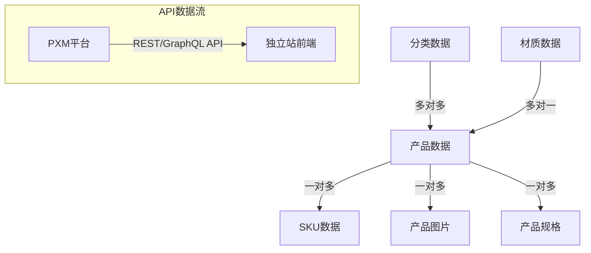

# 美妆包材Demo数据结构说明

> **用途**：用于PXM平台和后台系统对接的数据结构参考
> **说明**：基于美妆包材行业Demo的模拟数据，提取核心数据结构，展示通过API接口传输的数据格式

---

## 一、核心数据结构概览

### 1.1 数据关系图



### 1.2 API接口概览

| 接口类型 | 路径 | 说明 |
|---------|------|------|
| GET | /api/categories | 获取所有分类数据 |
| GET | /api/materials | 获取所有材质数据 |
| GET | /api/products | 获取产品列表 |
| GET | /api/products/:id | 获取产品详情 |
| GET | /api/products/:id/skus | 获取产品SKU信息 |
| GET | /api/products/:id/images | 获取产品图片 |

---

## 二、API数据结构详细说明

### 2.1 分类数据结构

**接口**: `GET /api/categories`

**用途**：管理产品的多维度分类体系，支持应用场景、材质、包装类型三个维度的独立分类

**响应数据结构**：
```json
{
    "success": true,
    "data": [
        {
            "id": "skincare",
            "slug": "skincare",
            "dimension": "application",
            "name": { 
                "zh": "护肤包装", 
                "en": "Skincare Packaging" 
            },
            "description": {
                "zh": "专为护肤品牌打造的高品质包装解决方案",
                "en": "Premium packaging solutions for skincare brands"
            },
            "image": "/images/categories/skincare.jpg",
            "icon": "sparkles",
            "parent": null,
            "sortOrder": 1,
            "productCount": 21
        }
    ]
}
```

**字段说明**：
- `dimension`: 分类维度
  - `application`: 应用场景（护肤/彩妆/家清）
  - `material`: 材质（玻璃/亚克力/塑料）
  - `type`: 包装类型（瓶类/罐类/管类）
- `parent`: 父分类ID，支持二级分类
- `productCount`: 该分类下的产品数量（由后端计算）

### 2.2 材质数据结构

**接口**: `GET /api/materials`

**用途**：管理包装材质的详细属性和特性

**响应数据结构**：
```json
{
    "success": true,
    "data": [
        {
            "id": "glass",
            "slug": "glass",
            "name": { 
                "zh": "玻璃", 
                "en": "Glass" 
            },
            "description": {
                "zh": "玻璃包装是高端美妆品牌的首选材质",
                "en": "Glass is the preferred material for premium beauty brands"
            },
            "properties": {
                "transparent": true,
                "recyclable": true,
                "lightweight": false,
                "premiumFeel": true,
                "chemicalResistant": true,
                "heatResistant": true
            },
            "pros": {
                "zh": ["高端质感", "化学惰性", "100% 可回收"],
                "en": ["Premium feel", "Chemically inert", "100% recyclable"]
            },
            "cons": {
                "zh": ["重量较重", "易碎", "单价较高"],
                "en": ["Heavier", "Fragile", "Higher cost"]
            },
            "typicalUse": {
                "zh": "精华瓶、面霜罐、香水瓶",
                "en": "Serum bottles, face cream jars, perfume bottles"
            },
            "image": "/images/materials/glass.jpg",
            "sortOrder": 1
        }
    ]
}
```

**properties字段说明**：
- `transparent`: 是否透明
- `recyclable`: 可回收
- `lightweight`: 轻量化
- `premiumFeel`: 高端质感
- `chemicalResistant`: 耐化学性
- `heatResistant`: 耐高温

### 2.3 产品数据结构

**接口**: `GET /api/products` 或 `GET /api/products/:id`

**用途**：管理产品的基本信息

**列表响应数据结构**：
```json
{
    "success": true,
    "data": {
        "products": [
            {
                "id": "lpk-gj-001",
                "slug": "luxury-glass-jar-001",
                "name": { 
                    "zh": "奢华玻璃面霜罐 50ml", 
                    "en": "Luxury Glass Face Cream Jar 50ml" 
                },
                "description": {
                    "zh": "高端玻璃材质，完美呵护您的珍稀配方",
                    "en": "Premium glass material to protect your precious formulations"
                },
                "material": {
                    "id": "glass",
                    "name": { "zh": "玻璃", "en": "Glass" }
                },
                "categories": [
                    { "id": "skincare", "dimension": "application" },
                    { "id": "face-cream-jars", "dimension": "application" },
                    { "id": "jars", "dimension": "type" }
                ],
                "heroImage": "/images/products/product-lpk-gj-001-hero.png",
                "isFeatured": true,
                "moq": 500,
                "priceRange": {
                    "min": 15.50,
                    "max": 12.50,
                    "currency": "CNY"
                },
                "sortOrder": 1
            }
        ],
        "pagination": {
            "page": 1,
            "limit": 20,
            "total": 36,
            "totalPages": 2
        }
    }
}
```

**详情响应数据结构**：
```json
{
    "success": true,
    "data": {
        "id": "lpk-gj-001",
        "slug": "luxury-glass-jar-001",
        "name": { "zh": "奢华玻璃面霜罐 50ml", "en": "..." },
        "description": { "zh": "...", "en": "..." },
        "material": { "id": "glass", "name": {...}, "properties": {...} },
        "categories": [...],
        "images": [...],
        "skus": [...],
        "specifications": [...],
        "seo": {
            "title": { "zh": "...", "en": "..." },
            "description": { "zh": "...", "en": "..." },
            "keywords": ["面霜罐", "玻璃包装"]
        }
    }
}
```

### 2.4 产品SKU数据结构

**接口**: `GET /api/products/:id/skus`

**用途**：管理产品的具体规格和定价信息

**响应数据结构**：
```json
{
    "success": true,
    "data": [
        {
            "id": "lpk-gj-001-50ml",
            "sku": "LPK-GJ-001-50ML",
            "name": { 
                "zh": "奢华玻璃面霜罐 50ml", 
                "en": "Luxury Glass Face Cream Jar 50ml" 
            },
            "capacity": "50ml",
            "dimensions": {
                "diameter": "65mm",
                "height": "45mm",
                "neck": "38mm",
                "weight": "120g"
            },
            "moqPricing": {
                "currency": "CNY",
                "tiers": [
                    { "minQty": 500, "unitPrice": 15.50 },
                    { "minQty": 1000, "unitPrice": 14.80 },
                    { "minQty": 5000, "unitPrice": 13.50 }
                ]
            },
            "leadTime": {
                "sample": "7 days",
                "massProduction": "15-20 days"
            },
            "sortOrder": 1
        }
    ]
}
```

### 2.5 产品图片数据结构

**接口**: `GET /api/products/:id/images`

**用途**：管理产品的多类型图片

**响应数据结构**：
```json
{
    "success": true,
    "data": [
        {
            "id": "img-001",
            "type": "hero",
            "url": "/images/products/product-lpk-gj-001-hero.png",
            "alt": { 
                "zh": "奢华玻璃面霜罐主图", 
                "en": "Luxury glass face cream jar hero image" 
            },
            "width": 800,
            "height": 800,
            "sortOrder": 1
        },
        {
            "id": "img-002",
            "type": "lifestyle",
            "url": "/images/products/product-lpk-gj-001-lifestyle.png",
            "alt": { "zh": "...", "en": "..." },
            "width": 800,
            "height": 600,
            "sortOrder": 2
        },
        {
            "id": "img-003",
            "type": "detail",
            "url": "/images/products/product-lpk-gj-001-detail.png",
            "alt": { "zh": "...", "en": "..." },
            "width": 800,
            "height": 800,
            "sortOrder": 3
        }
    ]
}
```

**图片类型说明**：
- `hero`: 主图（列表页展示）
- `lifestyle`: 场景图（使用场景展示）
- `detail`: 详情图（产品特写）

### 2.6 产品规格数据结构

**接口**: `GET /api/products/:id/specifications`

**用途**：管理产品的详细规格参数

**响应数据结构**：
```json
{
    "success": true,
    "data": [
        {
            "category": "物理特性",
            "items": [
                { "label": "口径", "value": "38mm" },
                { "label": "高度", "value": "65mm" },
                { "label": "重量", "value": "120g" },
                { "label": "容量", "value": "50ml" }
            ]
        },
        {
            "category": "材质特性",
            "items": [
                { "label": "材质", "value": "高硼硅玻璃" },
                { "label": "透明度", "value": ">90%" },
                { "label": "耐温范围", "value": "-20°C ~ 120°C" }
            ]
        },
        {
            "category": "印刷工艺",
            "items": [
                { "label": "丝网印刷", "value": "支持" },
                { "label": "烫金", "value": "支持" },
                { "label": "UV印刷", "value": "支持" }
            ]
        }
    ]
}
```

---

## 三、API接口设计说明

### 3.1 数据同步机制

**从PXM到独立站的数据流**：
1. **PIM模块**管理所有产品基础数据
2. **DAM模块**管理所有图片和数字资产
3. 通过API接口同步到独立站
4. 前端通过REST/GraphQL API获取数据

### 3.2 接口调用示例

**获取产品列表（带筛选）**：
```http
GET /api/products?category=skincare&material=glass&page=1&limit=20
```

**响应示例**：
```json
{
    "success": true,
    "data": {
        "products": [...],
        "filters": {
            "categories": [...],
            "materials": [...],
            "types": [...]
        },
        "pagination": {...}
    }
}
```

### 3.3 多语言支持

所有需要多语言显示的字段都采用JSON格式：
```json
{
    "zh": "中文内容",
    "en": "English Content"
}
```

### 3.4 扩展性设计

1. **自定义属性**：通过JSON字段支持灵活的属性扩展
2. **分类维度**：可根据行业需求增加新的分类维度
3. **规格模板**：不同产品类型可使用不同的规格模板

### 3.5 性能优化建议

1. **缓存策略**：
   - 分类树结构适合使用Redis缓存
   - 产品列表使用分页缓存
   - 多语言内容使用CDN分发

2. **数据分页**：
   - 列表接口必须支持分页
   - 提供总数统计用于前端展示
   - 支持按排序字段排序

3. **字段选择**：
   - 列表接口返回核心字段
   - 详情接口返回完整信息
   - 支持fields参数选择返回字段

---

## 四、GraphQL查询示例

### 4.1 产品查询

```graphql
query GetProducts($filters: ProductFilters, $first: Int, $after: String) {
    products(filters: $filters, first: $first, after: $after) {
        edges {
            node {
                id
                slug
                name
                heroImage
                material {
                    id
                    name
                    properties
                }
                categories {
                    id
                    name
                    dimension
                }
                priceRange {
                    min
                    max
                    currency
                }
            }
        }
        pageInfo {
            hasNextPage
            endCursor
        }
        totalCount
    }
}
```

### 4.2 产品详情查询

```graphql
query GetProductDetail($id: ID!) {
    product(id: $id) {
        id
        slug
        name
        description
        material {
            id
            name
            description
            properties
            pros
            cons
        }
        categories {
            id
            name
            dimension
        }
        images {
            type
            url
            alt
        }
        skus {
            id
            capacity
            dimensions
            moqPricing
        }
        specifications {
            category
            items
        }
    }
}
```

---

## 五、对接注意事项

### 5.1 数据一致性

- 产品计数需要通过后端实时计算
- 软删除策略：重要数据建议使用标记删除
- 图片URL需要保证可访问性

### 5.2 错误处理

```json
{
    "success": false,
    "error": {
        "code": "PRODUCT_NOT_FOUND",
        "message": "Product not found",
        "details": {...}
    }
}
```

### 5.3 认证授权

- 查询接口：可公开访问
- 管理接口：需要API Key或JWT认证
- 限流策略：防止API滥用

---

## 六、总结

这套API数据结构设计体现了PXM平台的核心能力：

1. **多维度分类管理**：通过dimension字段实现灵活的分类体系
2. **多语言支持**：JSON格式存储，便于国际化扩展
3. **丰富的产品属性**：支持SKU、图片、规格等完整信息
4. **B2B业务特性**：MOQ定价、材质属性等符合行业需求
5. **高度可扩展**：JSON字段和灵活的结构设计

该结构可以直接用于PXM平台的API开发，也可作为其他行业Demo的数据模型参考。
